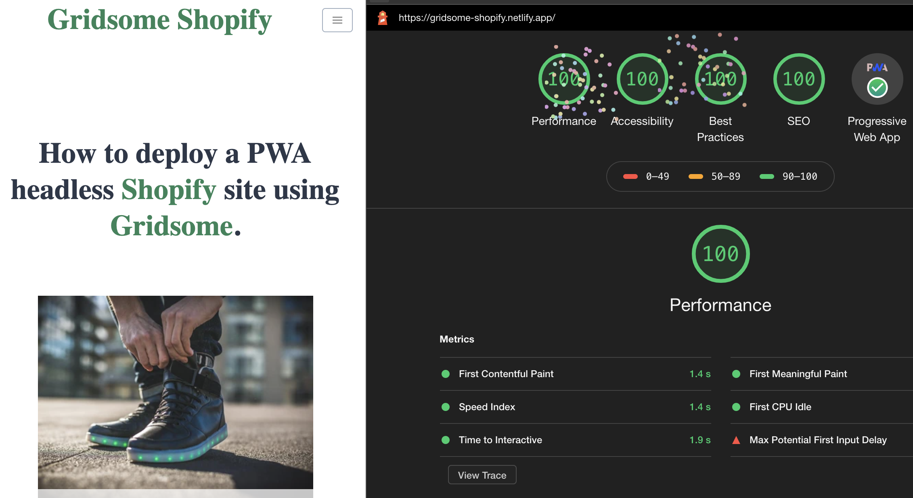

# heathertovey.com

Uses the Gridsomify boilerplate starter, optmized to reach the highest scores on Google Lighthouse. Integrates with Shopify Storefront API to pull in product data and direct to Shopify checkout.

## Features

- 4 x 100% Highest Scores on Google Lighthouse!
- Full SSR (Server Side Redenring) Static Site
- Progressive Web App (PWA) with "Add to Home Screen" button.
- Connected to Shopify backend
- Product Page
- All Collections Page
- SEO optimized
- Sitemap
