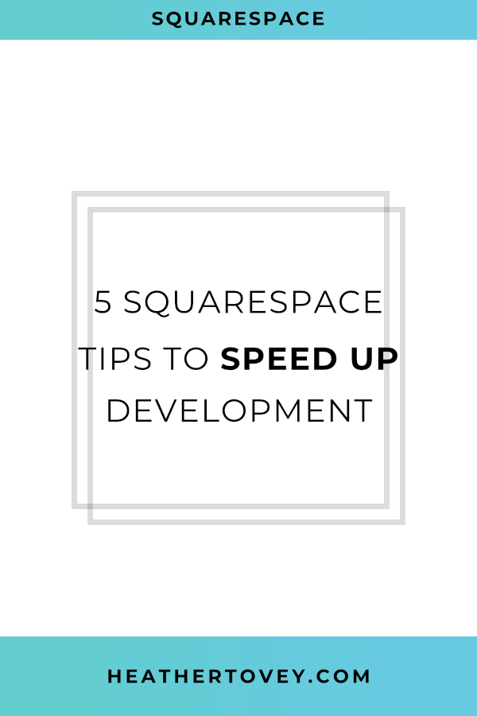
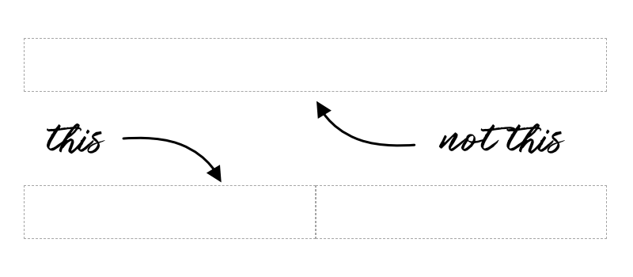
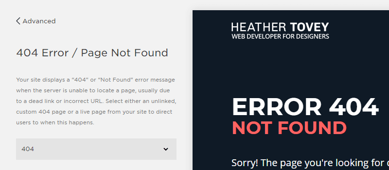

Squarespace makes a designer's life simpler by providing so many built-in options. But there are still times when you find yourself reaching for code or needing some guidance on how to work around a default style.

To help you speed up your website development, here are 5 tips that I use on nearly every Squarespace website I build.



 

## Use Collapsing Spacer Blocks

Spacer blocks are handy for adding white space, but they often take up too much space on mobile!



To get around this, place two spacer blocks next to each other. On tablet and desktop, these spacer blocks will add white space to your design. But on mobile, they'll collapse and the white space will disappear.

 

## Use H4 Headings

Squarespace provides you with styles for H1, H2, and H3 headings right out of the box. But what if you want to make use of H4 headings?

Use a markdown block and add the following text:

```md
#### H4 Header Title Goes Here
```

The 4 hashtags tell the markdown block that you want that line to be an H4 heading.

To customize your H4 heading, you'll need to add some custom CSS to **Design > Custom CSS**.

Use this code to get you started:
```less
h4 {
 font-size: 1.1em;
 font-weight: 600;
 text-transform: uppercase;
}
```
 

## Create a custom landing page

Cover pages in Squarespace are awesome, but they don't allow for a lot of customization. If you need more from your landing pages, consider building a regular page and then hiding the header, footer, and announcement bar.

To hide the header and footer on a particular page, place the following code in your landing page's **Settings > Advanced > Page Header Code Injection**.

If this doesn't work for your particular template, [leave a comment below](#comments) with a link to your website and I'll take a look.

```less
header, footer, .sqs-announcement-bar {
    display: none;
}
```

## Create a Custom 404 Page

To add to your reader's experience and fully design out the website, create a custom 404 page. By designing an excellent 404 page, you can offer readers a better experience than the Squarespace default message provides.



To do this, create a cover page (or regular page). Then, set it as the 404 page in **Settings > Advanced > 404 Error / Page Not Found**.

 

## Style Everything At Once

Does your Squarespace Style Editor workflow look like this?

1. Put blocks on a page.
2. Go to the Style Editor and style those blocks.
3. Go to another page.
4. Put different blocks on that page.
5. Go back to the Style Editor to style the new blocks.
6. Repeat ad nauseam.

If so, there's a better way.

Many of the Style Editor options are hidden to you if a block isn't present on the page you're styling.

So to make styling easier, create a **hidden private page** and place every single block and element on it. Add all of your headings, every type of image block, etc. and then style it all in one go.

Save yourself time and frustration!

## Faster Development = Happier Designer

I love discovering new Squarespace tips and tricks. Making your design and development more efficient cuts down the frustration (plus it means you can make the same amount of money for less effort).

I hope you find these Squarespace tips as useful as I do!
