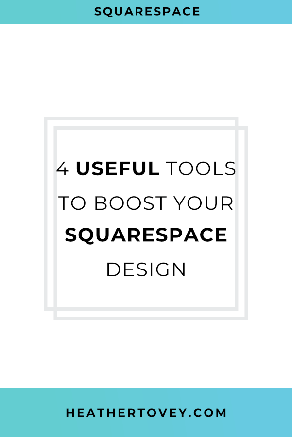
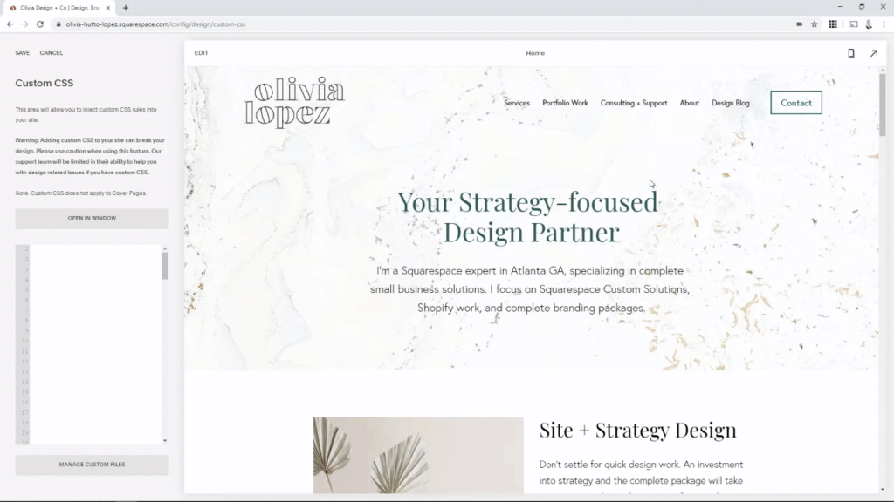
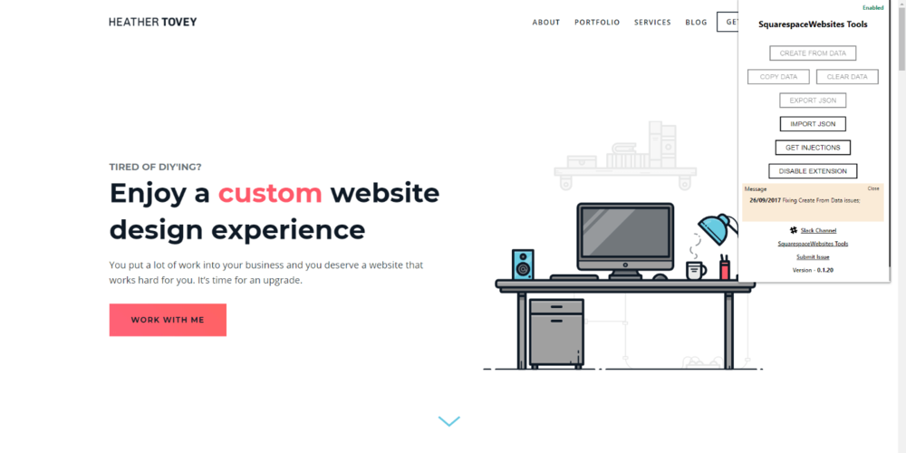
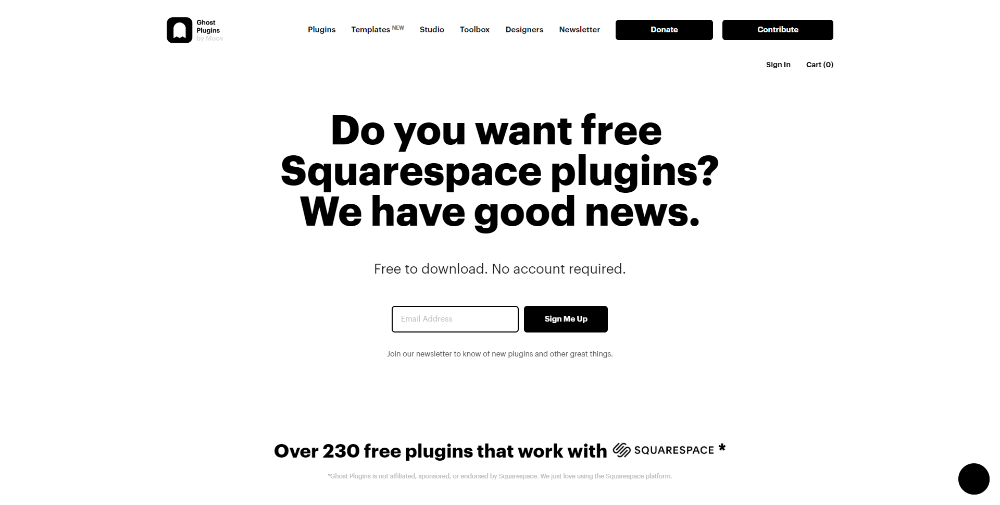

There's no point in spending hours on something that could take you 5 minutes.

We're busy people with busy lives. On any given day, you might find yourself talking to clients, marketing your business, spending time with friends and family, taking care of your children, and on and on and on. So the key to productivity is to be efficient!

As as web developer, I'm always looking for tools or resources to design websites quickly and efficiently. I love working on the Squarespace platform, so I thought I'd share of few tools and resources that help me to speed up my workflow.

## 4 Useful Tools to Boost Your Squarespace Design

### Squarespace ID Finder

If you've ever needed to know a specific block id so you could add CSS to your website, then you'll understand how useful the [Squarespace ID Finder](https://heathertovey.com/squarespace-id-finder/) is.

Instead of digging through the code looking for the specific block id you need, you can just use this tool to immediately see the block and collection ids (and more) used across your website. Simply click on the id you want in order to copy it to your clipboard so you can paste it into your code.

You might also like: [18 Tools to Help You Create Beautiful Color Palettes](/blog/color-palette-tools)

### SquarespaceWebsites Tools

When redesigning a Squarespace website, it's common practice to duplicate the website on a new trial site so that you don't mess with the live website during the redesign process. Unfortunately, Squarespace doesn't provide an easy way to duplicate Squarespace websites.

In comes [SquarespaceWebsites Tools](https://www.squarewebsites.org/squarespacewebsites-tools-extension-pro) to the rescue. While this is a paid plugin, it is incredibly valuable. In the regular version (there is a pro version too), you can easily import and export Squarespace pages and collections between Squarespace sites. It also allows you to import and export Style Tweaks (under Design > Style Editor) and Code Injections.

Hours and hours saved? Don't mind if I do.

### Squarespace Circle

Build 3 Squarespace sites and you're in the club! [Circle Membership](https://circle.squarespace.com/) gets you access to forums full of other web professionals, guides, discounts, and more.

If you're stuck on something or want to ask advice, this is the place to go.

You might also like: [How to Optimize Your Images and Speed Up Your Website](/blog/optimize-your-images)

### Ghost Plugins

[Ghost Plugins by Moov](https://www.ghostplugins.com/) is essentially a free repository of Squarespace code snippets submitted by the community. These plugins are easy to install and made for designers. You can download them for free or pay what you want. Any payment you make goes straight to the charity you choose.

Get ideas and code for designing summary blocks, headers, and so much more.
