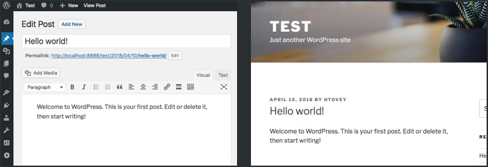
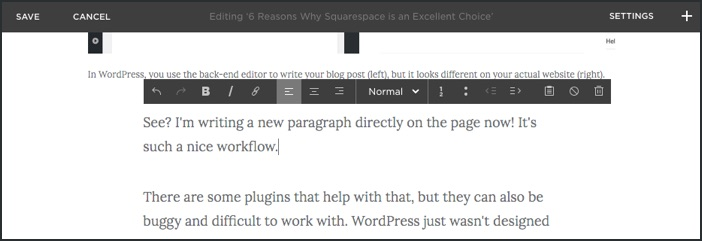
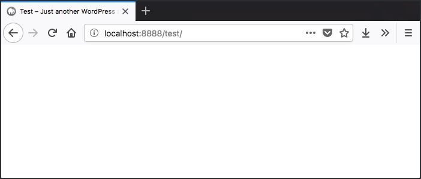

I'm not going to lie to you.

Squarespace isn't for everyone. It's not designed to be for everyone.

But it _is_ a great choice for a lot of businesses. Probably even yours.

I've worked on my fair share of websites. I've used WordPress. I've used Jekyll. I've handwritten HTML, CSS, and JavaScript from scratch.

I only say this because those experiences allow me to truly compare other platforms to Squarespace. And I definitely have a lot that I like about using Squarespace.

## 1\. You edit directly on the page

One issue I've seen come up again and again for new WordPress users is navigating the back-end. It looks and feels very different to the front part of the website (the part your visitors see) and it's easy for people to get lost.

 In WordPress, you use the back-end editor to write your blog post (left), but it looks different on your actual website (right).

There are some plugins that help with that, but they can also be buggy and difficult to work with. WordPress just wasn't designed with editing on the front-end in mind.

This isn't just a problem with WordPress. Most platforms don't allow you to edit directly on your pages.

So it's really refreshing to be able to do that in Squarespace. To be able to see how my writing and editing looks as I'm doing it instead of flipping back and forth between front-end and back-end.

 The Squarespace editor works directly on the page, so I don't need to navigate to a completely different page to change what I'm writing.

Editing directly on the page also means there's less time spent learning the platform and more time making content. Perfect for busy business owners.

## 2\. Your website works on desktop and mobile naturally

There's no excuse for a business to not have a responsive website.

A responsive website is basically one that works on all devices including laptops, desktop computers, tablets, and mobile phones. When your website is responsive, you're making your content more accessible and available to everyone.

Here's what having a responsive website gets you:

- **More visitors can see your content.** [Visitors on mobile devices are outnumbering visitors from desktop computers](http://gs.statcounter.com/press/mobile-and-tablet-internet-usage-exceeds-desktop-for-first-time-worldwide). So it's extra important to make sure that your website serves everyone, not just those who can see your nice large website.
- **Google likes you more.** SEO is valuable to every business owner, and impressing Google is pretty key. When people search for topics on their mobile phone, [Google prioritizes websites that are mobile-friendly](https://support.google.com/adsense/answer/6196932?hl=en). So to make sure that your page is being seen, you need a mobile-friendly website.

Squarespace websites are responsive by default. Just one more thing taken care of for you so you don't have to build it yourself.

## 3\. Squarespace forms are useful

I've spent a lot of time in the past trying to integrate Google Forms or Typeform, etc. onto my websites in a way that they looked good and on-brand.

It usually required a lot more work than seemed necessary, and it definitely isn't what I'd call fun.

Luckily, Squarespace forms can be used to build contact pages, inquiry forms, and even surveys. You can even hook it directly to Google Drive to store all of your data (and then analyze it later).

These forms automatically use the same styles found across the rest of your website, so you get to have easy-to-use on-brand forms right from the start.

## 4\. Beautiful base Squarespace templates

Okay, yeah, Squarespace may have fewer templates than other services. But, you can trust that they're high-quality templates.

No wading into a sea of ugly templates looking for the one rare one that's perfect for your site.

Instead, you get a selection of different templates with different features and you can choose the one that has the right features for your business.

Having access to fewer templates doesn't mean that you end up with a cookie-cutter website. The demo content is just there to show you what you _could_ do, not what you have to do. It's easy to start fresh with no demo content and add things that work for your business's brand.

So you get a nice base template with excellent design choices built in for you. And then you can edit and change things to your heart's content without having to build it all from scratch.

## 5\. No plugins

Some people may see this as a con rather than a pro, but I'm all for easier-to-manage websites. I'm all in for not having to fiddle with 3000 plugins to get the functionality that I need on my site.

In my time as a web developer, I've helped fix a lot of websites. And one common reason for a website to crash is a bad or conflicting plugin. This can lead to hours of frustration and troubleshooting that we as business owners just don't have.

 It may appeal to a minimalist, but the White Screen of Death is something you want to avoid happening to your website.

And too often a plugin author stops updating their plugin or sometimes a plugin just isn't very good to begin with.

I'm happy to wash my hands of mediocre plugins and enjoy the functionality that Squarespace provides as part of their service.

## 6\. Squarespace handles all the updates.

Having to take time out of your day to maintain your website is a productivity killer.

On other platforms, updates come out and you need to take time off to make sure that the new update won't conflict with plugins you're using before you can even begin.

One of the things I've really enjoyed about using Squarespace is not having to worry about updates. New features introduced by Squarespace generally just show up (or I can opt to turn them on) and then I can start using them right away.

## Squarespace is an excellent choice

Now don't get me wrong. There are definitely good reasons to use WordPress or other website platforms. And I often love working on static sites because it gives me more flexibility.

But what you lose in flexibility on Squarespace, you gain in functionality and an easier-to use system.

Use Squarespace if:

- you don't have someone on your team devoted to maintaining your website
- you don't have time to learn how to efficiently maintain the back-end of your website yourself
- you want access to dedicated support if things do go wrong on your website
- Squarespace covers the functionality that your business needs

And there you have it. The 6 reasons why I like working with Squarespace and think it's a great choice for your business.
