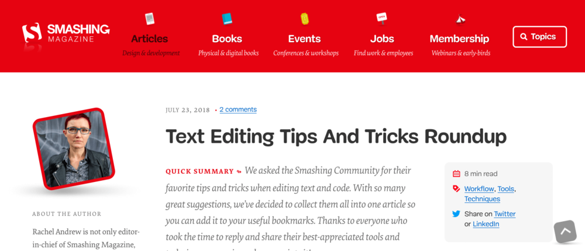
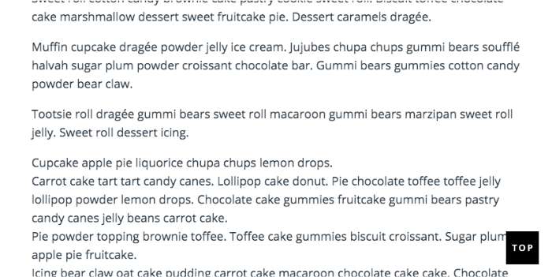
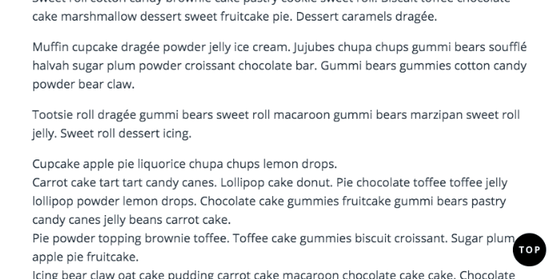

* * *

**Update:** This code has been completely transformed on May 24, 2019 in order to work with more browsers and with more Squarespace templates. Please let me know if you run into any issues.

**\*Requires a Business or above account to add JavaScript code snippets.\***

* * *

I was chatting with a few fellow Squarespace designers a couple of weeks ago, and we were discussing how to add Back-to-Top buttons to Squarespace websites.

Some templates provide this feature straight out of the box, but many templates (including Brine) do not.

You've probably seen Back-to-Top buttons around the web. They're buttons that often show up on the bottom right-hand of your browser when you're scrolling down a long page of content.

[](https://www.smashingmagazine.com) In the bottom-right corner, there's a back-to-top button! Go to smashingmagazine.com to see it in action.

These buttons give your reader a way to quickly scroll back up to the top of the page (which then allows them to click on another link in your menu).

Given how popular long-form content is, you may just find yourself wanting to add a Back-to-Top button to your Squarespace website. And if you're not using one of the templates with this feature built-in, you're going to need to add custom code.

Luckily, I have the code to help you add a back-to-top button to your Squarespace website today!


## A Few Guidelines for Back-to-Top Buttons

Before I give you the code, let's take a minute to cover the best way to offer your readers a great experience using back-to-top buttons.

1. Use back-to-top buttons on long pages. Short pages don't need them.
    
2. Ideally, set up your back-to-top button to show up on the bottom-right corner of your website. That's where your readers will generally expect to find it.
    
3. Have your back-to-top button fade in as your readers scroll down the page rather than having it show up from the very beginning.
    

If you want to read more on how to make the most of back-to-top button design, check out the Nielsen Norman Group article covering [Back-to-Top Button Design Guidelines](https://www.nngroup.com/articles/back-to-top/).

Alright, on to the code!

## Code for Floating Back-to-Top Button

* * *

**Note:** You'll need a Business plan or higher in order to inject this code onto your site.

* * *

### Add code!

For each page that you want to add a back-to-top button, you'll need to add the following code (**Page Settings > Advanced > Page Header Code Injection**).

Alternatively, you can also choose to place this code just once under **Settings > Advanced > Code Injection > Footer**, but then the Back-to-Top button will show up on **every page** of your website.

**Version 1 - Square with Text**



Here's the code:
```html
<!-- Styles your button (this is a black square with white text) -->
<style>
  .back-to-top {
    background-color: #000000;
    color: #FFFFFF;
    opacity: 0;
    transition: opacity .6s ease-in-out;
    z-index: 999;
    position: fixed;
    right: 20px;
    bottom: 20px;
    width: 50px;
    height: 50px;
    box-sizing: border-box;
    border-radius: 0%;
  }

  a.back-to-top {
    font-weight: 1000;
    letter-spacing: 2px;
    font-size: 14px;
    text-transform: uppercase;
    text-align: center;
    line-height: 1.6;
    padding-left: 2px;
    padding-top: 14px;
  }

  .back-to-top:hover, .back-to-top:focus, .back-to-top:visited {
    color: #FFFFFF;
  }

  .back-to-top.show {
    opacity: 1;
  }
</style>

<!-- Adds the back to top link to your website -->
<a href="#" id="back-to-top" class="back-to-top" style="display: inline;">Top</a>

<!-- Fades in the button when you scroll down -->
<script>
  var link = document.getElementById("back-to-top");
  var amountScrolled = 250;

  window.addEventListener('scroll', function(e) {
      if ( window.pageYOffset > amountScrolled ) {
          link.classList.add('show');
      } else {
          link.className = 'back-to-top';
      }
  });  
<!-- Scrolls to Top -->
  link.addEventListener('click', function(e) {
      e.preventDefault();

      var distance = 0 - window.pageYOffset;
      var increments = distance/(500/16);
      function animateScroll() {
          window.scrollBy(0, increments);
          if (window.pageYOffset <= document.body.offsetTop) {
              clearInterval(runAnimation);
          }
      };
      // Loop the animation function
      var runAnimation = setInterval(animateScroll, 16);
  });
</script>
```

**Version 2 - Circle with Text**



Only one small change is needed to change the square into a circle. To do that, change

```css
border-radius: 0%;
```

to

```css
border-radius: 50%;
```

**Version 3 - Image**


You'll need to create an image for this version (or use the one I created below). Once you've created your image, take note of the width and height of your image. You'll need that to change the code.

[](https://heathertovey.com/wp-content/uploads/2018/07/back-to-top.png)

[**Click to download!**](https://heathertovey.com/wp-content/uploads/2018/07/back-to-top.png)

* * *

**For your choice of 15 custom back-to-top images, check out this freebie:** [**Custom Back-to-Top Buttons**](/custom-back-to-top-buttons)**.**

If you want more freebies like this, [sign up for my newsletter](/sign-up). I offer extra resources and coding snippets to my readers every week.

* * *

The image that I'm providing today is 50x50 pixels.

Once you have your image, you'll need to upload it to your website under **Design > Custom CSS > Manage Custom Files**. You can then click on the image to paste the URL into your Custom CSS. Copy the URL and then delete it from your Custom CSS section (leave it in Manage Custom Files).

Pay special attention to the code below. I added a couple of extra comments to walk you through how to use this code with your own image.

```html
<!-- Styles your button (this is a 100x100 pixels image) -->
<style>
.back-to-top {
    /* Remove the background color */
    color: #FFFFFF;
    opacity: 0;
    transition: opacity .6s ease-in-out;
    z-index: 999;
    position: fixed;
    right: 20px;
    bottom: 20px;
  
    /* Change the width and height to match your image dimensions */
    width: 50px;
    height: 50px;
    box-sizing: border-box;
    border-radius: 0%;
}
  
  .back-to-top.show {
       opacity: 1;
  }
</style>

<!-- Adds the back to top link to your website. Replaces the text with an image of your choosing. Add your own image url where it says ADD URL HERE. -->
<a href="#" id="back-to-top" class="back-to-top" style="display: inline;"></a>  
<!-- Fades in the button when you scroll down -->
<script>
  var link = document.getElementById("back-to-top");
  var amountScrolled = 250;

  window.addEventListener('scroll', function(e) {
      if ( window.pageYOffset > amountScrolled ) {
          link.classList.add('show');
      } else {
          link.className = 'back-to-top';
      }
  });
  
<!-- Scroll to Top -->
  link.addEventListener('click', function(e) {
      e.preventDefault();

      var distance = 0 - window.pageYOffset;
      var increments = distance/(500/16);
      function animateScroll() {
          window.scrollBy(0, increments);
          if (window.pageYOffset <= document.body.offsetTop) {
              clearInterval(runAnimation);
          }
      };
      // Loop the animation function
      var runAnimation = setInterval(animateScroll, 16);
  });
</script>
```

## Back-to-Top Buttons are Great For Your Readers

Even if your Squarespace template doesn't have built-in support for Back-to-Top buttons, you can still add them with some custom code. Play around with the colors or create your own image to match your brand!