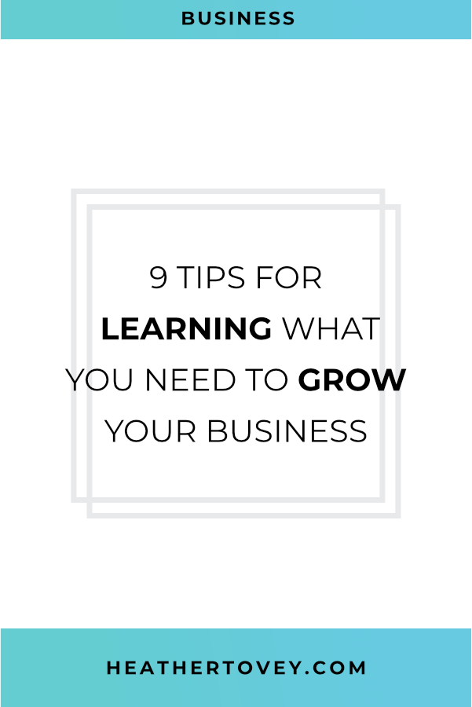

You don't need that webinar. Put away that ebook. Unsubscribe from that podcast.

We're **inundated** with information. It's no wonder that our attention spans are constantly being disrupted by the next new learning experience.

How many email newsletters have you signed up to? How many courses have you bought? How many ebooks have you downloaded?

And how many of those did you actually complete or get valuable information from?

If you're like most people, you probably have a ton of barely started courses waiting for your return.

But don't get me wrong. I think learning is incredibly valuable. I believe that it's the best way to achieve growth personally and professionally.

But there's a better way to learn than to hop from course to course as time permits. The biggest key? **Know what you need to know next.**

  

 

## Where are you in your business life cycle?

To really benefit from courses, ebooks, and webinars, you need to know what you should be learning.

The typical business life cycle has 6 stages.

1. Idea Formation
2. Launch
3. Survival
4. Success
5. Growth
6. Maturation

Where is your business on this cycle?

That question will help you focus your learning on the knowledge you need right now. By learning just what you need now and putting it into action immediately, you're more likely to remember it and make the most use out of it.

Here are some examples of what you might want to learn based on the business stage you're in.

### Stage 1: Idea Formation

In this stage, you're forming ideas about the type of business you're going to run. You're defining your audience and what type of content you'll create. You're doing research on your target market and creating the basic content you'll need to start your business.

Example Topics You May Be Learning

- How to Start a Business
- Choose a Target Audience
- Understand Your Ideal Client
- Define Your Brand

You might also like: [100+ Important Questions You Need to Ask Before Designing Your Website](/blog/before-designing-your-website)

### Stage 2: Launch

In this stage, you took your idea and ran with it. You're out there in the world and now you want everyone to know. Your challenges are to market yourself well, get clients, and make sure you're offering services that people will buy.

Example Topics You May Be Learning

- Practical knowledge about the social media platforms you're on (How to Use Pinterest, Facebook Pages, Facebook Groups, Twitter, Instagram, etc.)
- Find Your First Client
- What to Put on a Homepage
- How to Write a Sales Page
- Define Your Niche

### Stage 3: Survival

In this stage, your business is surviving, but you're wearing a lot of hats. Your main challenge is to figure out how to make the most of your time so that your business is doing more than just surviving.

Example Topics You May Be Learning

- Get Organized with Systems and Processes
- How to Get a Steady Stream of Clients
- How to Raise Prices and Offer More Value
- How to Hire Employees and Assistants
- Time Management Skills

### Stage 4: Success

In this stage, you're running a successful business. Congratulations! You can take time off without worrying that your business will fall apart or completely stop running while you're away. Your challenges now are to decide if you want to maintain this level of success, grow the business, or diversify into other service offerings or another market.

Example Topics You May Be Learning

- How to Nurture Your Clients
- How to Sustain Your Business
- Cut Unnecessary Costs and Get Ready for Growth
- Should I Grow or Diversify?
- Work/Life Balance
- How to Create Passive Income Streams
- How to Create Secondary Income Streams

### Stage 5: Growth

In this stage, you've decided to turn your small company into a large company. You're looking to grow rapidly, and your challenge is to generate enough income to do so.

Example Topics You May Be Learning

- Effectively Manage Your Employees
- Invest in the Right Projects and Opportunities
- Ways to Finance Growth
- Transition a Small Business into a Large Company

### Stage 6: Maturity

In this stage, your business has become a mature and stable company. You're no longer rapidly growing and your challenges are to keep the energy alive in your business despite the lack of rapid growth.

Example Topics You May Be Learning

- How to Keep Your Employees Motivated
- How to Stay Innovative as a Large Company
- Find New Avenues for Growth
- Split Your Company into Divisions
- Exit Strategies

Keep in mind that your business doesn't have to go through each of these cycles (and many stop in Survival or Success Stages if they don't fail).

Once you know which stage your business is in (and where you might be going next), you can more easily choose what you need to learn right now to help you on your business journey.

## Tips for Learning More Efficiently

While knowing what to learn next is useful, you still need to stay focused and organized. Distracted learning is how you end up barely starting 50 different courses and feeling like you've wasted your time. Use your time wisely (and save money) with the following tips.

1. Get comfortable with the fact that you can't learn everything. There's just too much content in the world to consume it all. Don't let the fear of missing out lead you off the path to your goals.
    
2. Keep a list of interesting learning opportunities. Include books, courses, webinars, email series, and anything else that you're interested in investing in. Don't automatically buy these. Just add them to your list for now.
    
3. Determine where you are in your business life cycle.
    
4. Write down your goals. What are you working toward? What do you need to learn to get there? In what order do you need to learn those things?
    
5. Take a look at what you need to learn next to reach your goal. Now, take a look at your list of learning opportunities. Are there any items on your list of learning opportunities that would help you fill in the knowledge you need **right now**?
    
6. Only focus on learning opportunities that **immediately** help you with your goals. Don't get distracted by limited-time opportunities. There will always be another one later.
    
7. Delete or archive everything that you don't need now. All those newsletter lists you're on because you might need the information one day? **Unsubscribe**. All the inspirational podcasts with no practical takeaways you're listening to? **Cut them from your list.** All the ebooks and courses and videos taking up space on your hard drive? Okay, I won't make you delete them, but you should at least **store them away somewhere** so they're not taunting you every day.
    
8. Learn what you need, then apply it as soon as possible.
    
9. Feel free to learn things just for fun too. Consider scheduling some of your work hours for business education while using your off-time to learn non-business "just for fun" topics.
    

You might also like: [How to Overcome Perfectionism as an Entrepreneur](/blog/overcome-perfectionism-as-an-entrepreneur)

## Learn Effectively By Knowing What You Need To Learn Next

I love learning. There is something so satisfying about gaining new information. But it's even more satisfying when I can immediately apply that newfound knowledge.

Avoid getting distracted and losing valuable time that you could be putting into your business. Don't sign up to every course or download every ebook just because you might want to know that information one day.

By strategizing and planning out your business journey, you can more efficiently learn the ideas that you need to grow your business now.