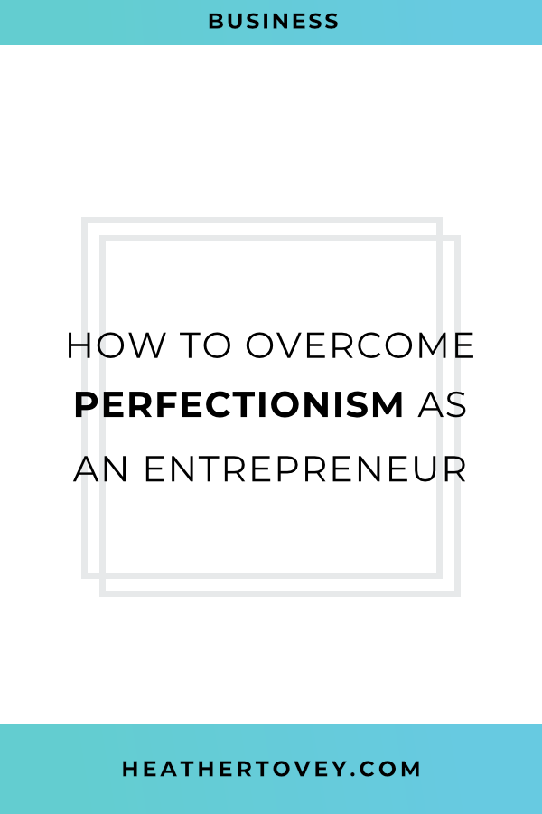

My daughter is so happy when she's dancing.

She looks free and happy and she doesn't care how she dances because she's enjoying herself.

As we get older, we sometimes lose that freedom. Too busy paying attention to what others think. Too busy trying to perfect our work, and too afraid to show our work to others.

I see this a lot in entrepreneurs and designers.

> “Oh, this website isn’t quite there yet. There’s just something off about it.”

> “My product isn’t ready to launch yet! I still have so much to work on.”

> “My online course is so bad compared to others. Why would anyone buy it?”

I've said things like this to myself. And I've made the mistake of delaying my own website launch because I wasn't 100% certain that the website would be perfect.

But here's the thing. Launched is better than perfect. You're never 100% done with any design or product. There's always room to improve.

And if you don't get started as soon as possible, you lose out on all the time to learn and grow and get better with real feedback from real people.

## Are You a Perfectionist?

Here are 7 questions to ask yourself:

1. Do you feel like your work is never enough?
    
2. Do you delay launching (and sometimes never launch) because a design or business idea isn't perfect?
    
3. Do you have trouble meeting deadlines or publishing posts?
    
4. Do you feel like a failure if you launch with anything less than perfection?
    
5. Do you take longer than others to perform the same tasks because you're overly cautious and thorough?
    
6. Do you spend an excessive amount of time checking every email you send out for spelling, grammar, or tone issues?
    
7. Do you constantly agonize over the content on your website/courses/services and try to improve it by re-doing it over and over?
    

My guess is that you've experienced at least one of these items while running your own online business.

There are different levels of perfectionism. You can be a healthy perfectionist and not let it run your life. But if you find that perfectionism is holding you back, it's important to deal with it so you can:

- drop the anxiety
    
- get started promptly on projects instead of procrastinating
    
- launch products and services
    
- avoid analysis paralysis
    

## Tips for Dealing with Perfectionism

This list is not the end all be all of dealing with perfectionism, but it's a good start.

### 1\. Stop comparing yourself to others.

You're probably in a handful or more groups related to your business. And you probably see people posting about their success.

Maybe it makes you jealous. Maybe it makes you anxious wondering if that will ever be you. Maybe it makes you feel like you can't launch anything until it's as perfect as what others are producing.

But that isn't healthy thinking and it can hurt your productivity.

Instead, compare yourself to...**yourself**.

What were you capable of last year? What have you learned since then? What are you capable of now compared to 5 years ago?

You've changed and you've grown, and you can only compare your progress to your past self.

### 2\. Other people's achievements are also a product of time, practice, and failures.

Even though I recommend not comparing yourself to others, we all slip up. But you can and should put others' achievements into perspective.

People don't often talk about their failures, their mistakes, and the time it's taken them to reach success. But without that context, it can feel like everyone else is reaching success so much faster and easier than you are.

But that's simply not true. No one is perfect and everyone has their own obstacles to deal with.

### 3\. It's okay if people don't like your work.

Great work isn't meant to be liked by everyone. Great work is meant to spur your target audience into action.

Focus on who your work is affecting and how you can make it better for your audience.

If people outside of your audience don't like it, that's fine. It's not meant for them.

### 4. Procrastinate by working on other parts of your project.

Not all perfectionists procrastinate, but if you're one who does, try to procrastinate in a productive way.

Switch projects or activities. Avoid social media. Promise yourself you'll just work on the project you're dreading for 5 minutes. Sometimes getting started is the hardest part. Once you start, it's easier to keep going!

### 5\. Set time limits for researching options.

If you're the type of procrastinator to get stuck in analysis mode where you keep researching without ever choosing a direction, time limits can help.

As an example, commit to making decisions after you've looked at 5 sources or after 20 minutes. Learning to make quick decisions is key to dealing with this type of perfectionism.

### 6\. Complete the must-haves first.

Perfectionists often waste time by trying to get one aspect of their project to 100% instead of trying to get every part of their project to 80%.

But as a perfectionist, your 80% is already better than a lot of other entrepreneurs' 100%.

Make a list of everything that needs to be done to complete a project. Identify the must-haves and the nice-to-haves. Be honest with yourself. Which items are most important? Which items are a nice touch, but the service/design/product will be fine without it?

If you have time, you can go back and add detail, but first focus on making sure that every part of your work is complete **enough**. You'll know when it's complete enough when you transition from a smooth workflow to dragging your feet.

## Take it One Day at a Time

Overcoming perfectionism doesn't happen suddenly. You have to keep working at it.

Remember to enjoy your work. Remember that it's okay to put out work that is good enough instead of perfect. Commit to improving your work over time, not all at once before you even launch.