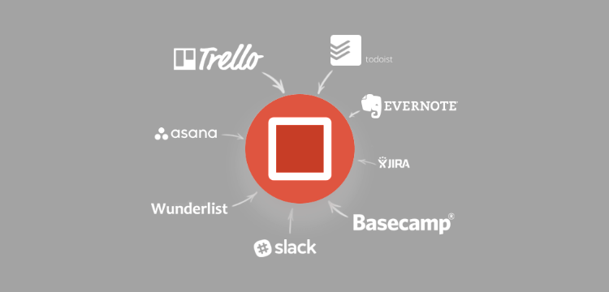

There simply isn't enough time in the day for everything that we have to do as entrepreneurs.

Between writing content, marketing our services, and meeting with potential clients, it sometimes feels like there's not enough time for the actual work that gets us paid.

As entrepreneurs, we wear a lot of hats. So how do you stay focused and make sure that all the work is getting done?

I'm a big believer in time tracking. I love looking back on the statistics of the past week or month or year and seeing where I can make my work a bit more efficient.

When I first started tracking my time, I found that my processes were a little all over the place. I'd often have multiple projects going on at once. I spent too much time switching tracks and getting into the right headspace for each project.

Now, I use the Pomodoro Technique to help keep me on track.

## What is the Pomodoro Technique?

The Pomodoro Technique was created by [Francesco Cirillo](https://francescocirillo.com/) and is a simple method to track your time.

Cirillo encourages you to use a Pomodoro timer to track your time. The system works like this:

1. 25 minutes of focused work
2. 5-minute break
3. 25 minutes of focused work
4. 5-minute break
5. 25 minutes of focused work
6. 5-minute break
7. 25 minutes of focused work
8. 15-30 minute long break!

So in about 2 1/2 hours, you will have accomplished nearly 2 hours of solid, focused work with breaks evenly spaced throughout.

You can get more done with these focused bursts of productivity than if you just worked for that 2 1/2 hours straight.

> “Non-stop focus on one thing for hours on end will only leave you drained. Take a well-timed break, however, and your mind will be sharper, more focused, and more energized.”

— [Melanie Pinola](https://blog.trello.com/taking-breaks-key-productivity) from Trello

## How I Use the Pomodoro Technique

I don't have a cute Pomodoro timer. I work in a very digital field, so it makes sense that the tools I prefer also happen to be digital. (Plus, I learned the hard way that my daughter would think the timer is a toy and I'd never see it again.)

I've tried a number of solutions (including making my own [Pomodoro timer](http://hrtovey.github.io/pomodoro-timer)), but what I'm really enjoying using right now is [Pomodone](https://pomodoneapp.com/).

Pomodone allows you track your time in Pomodoro sessions, but also has a lot of extra features I find really useful:

- integration with ToDoist (my to-do list of choice)
- integration with other 3rd-party tools (Asana, Basecamp, Slack, Trello, Wunderlist, Evernote, etc.)
- daily, weekly, and monthly time tracking reports
- desktop app that pops up and reminds me when I haven't started a timer in a while
- a free version with enough basics that make it worth checking out

Every day, I sit down and start up ToDoist and Pomodone. I spend the first 25-minute Pomodoro session getting caught up on what I need to focus on that day and any urgent emails that come in from clients. The following Pomodoros are spent working on the different todos I need to complete that day.

If I finish a todo item early, I just switch tracks to the next project. Pomodone makes switching to different items within the same Pomodoro session simple, which is a feature I particularly appreciate.

I find that the work I get done using the Pomodoro Technique is more focused and more efficient. I get more work done in a shorter period of time and I feel accomplished at the end of the day.

## Pomodoro Tools and Resources

If you're curious about what other tools and resources are out there, here are few that I've used or that get great reviews!

- [The official website for the Pomodoro Technique](https://francescocirillo.com/)
- [Pomodone](https://pomodoneapp.com/) - my current time tracker of choice
- [How many pomodoros in a day?](https://pathjet.com/how-many-pomodoros) - A quick and easy tool to help you determine how many Pomodoros you can complete in your schedule (and what's possible vs what's realistic)
- [MarinaraTimer](https://www.marinaratimer.com/) - a free and popular web app that lets you set custom times if the Pomodoro Technique is a little too rigid for your tastes
- [Pomello App](https://pomelloapp.com/) - if you love Trello, try out this free extension that integrates with your Trello boards. Pomello App turns each of your Trello cards into a Pomodoro task.

## Track Your Time

Even if the Pomodoro Technique isn't right for you, I highly encourage you to find a tool or method that you love and start tracking your time every day.

Just like we use Analytics to track our website performance and our newsletter campaigns, tracking your time opens up a whole world of information to make your business more efficient.