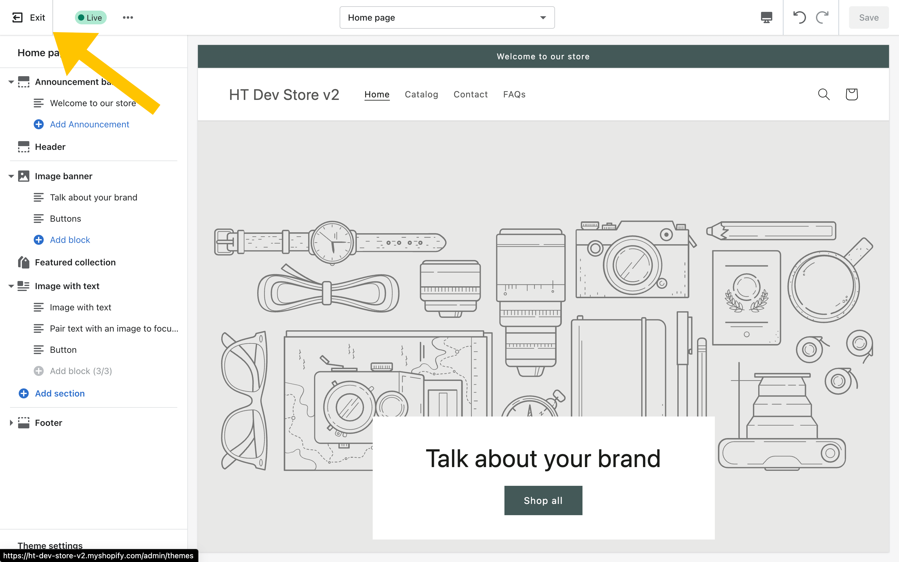
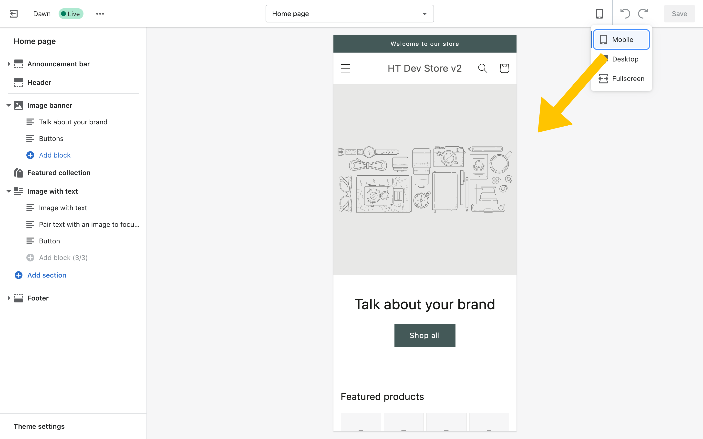
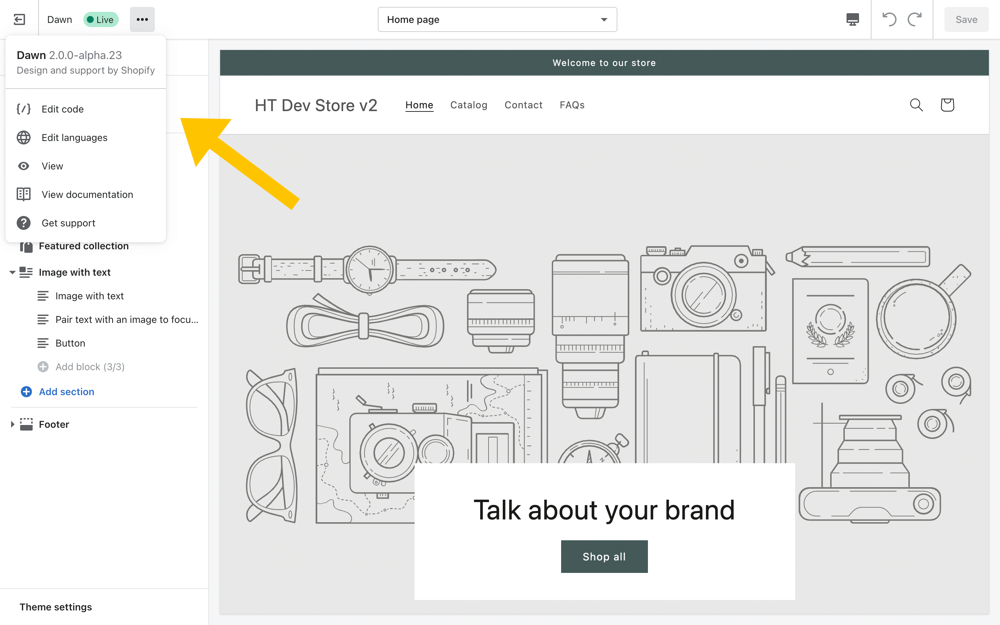
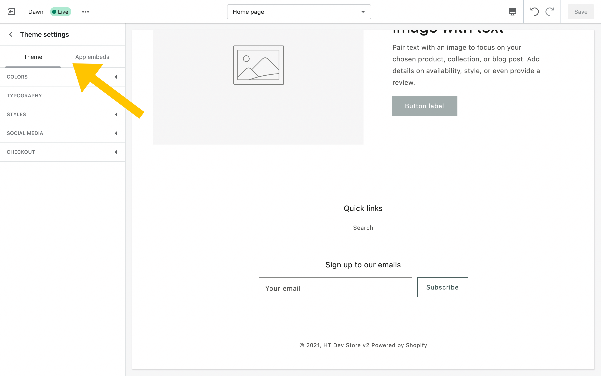

Not sure where to get started with customizing Shopify themes? Need a quick walkthrough so you can dive in? Let's break it down.

## What is the Shopify Theme Editor?
The Shopify Theme Editor is where you and your clients can customize your theme. You'll find:
- Site-wide theme settings like fonts and colors
- Cart and checkout page settings
- Header and footer settings (logos, navigation, etc.)
- Section settings (including content that goes directly into a section)

The Theme Editor doesn't change the content in your product information or blog posts, but it can allow you to customize how you display your products and blog posts. For instance, you can choose if you want to show a collection of products on different pages.

The Theme Editor can be used to customize each theme separately. Settings changed in one theme will not affect settings in another theme. So you can feel free to duplicate themes and play around with settings and sections without disrupting the live site.

## Top Bar

The Shopify Theme Editor can be loosely divided into 2 areas: the Top Bar and the Sidebar. The top bar is where you'll find some controls to help you more easily navigate and view the different theme settings.

### 1. Exit Button

The Exit button will quickly take you out of the Theme Editor and back to the Themes admin screen.

### 2. Theme Information
![ Theme name, "Dawn", is to the right of the Exit button. Theme status is shown to the right of the theme name. In this theme status, there is a green dot to the left of the word "Live". The green dot and the word "Live" share a lighter green background. Theme Actions is a dropdown menu with a 3 dot icon as the toggle button. It's placed to the right of the Theme name and status. Inside this dropdown menu, you have the Theme Information: "Dawn 2.0.0-alpha.23" and "Design and support by Shopify" directly underneath that. Underneath this information, you will find the Theme Action links (noted below). ](./images/tour/tour-theme-editor.png)
Here, you'll find:
- your theme name
- the theme status: Live or Draft
- a Theme Actions menu for quick access to more detailed theme information and links to:
  - the Code Editor
  - Language Editor
  - Preview Theme
  - the documentation associated with this theme (default is the Shopify homepage, but many theme developers have their own documentation)
  - the support page associated with this theme (default is Shopify support, but many theme developers have their own support pages)

### 3. Template Picker
![The template picker is a dropdown menu with the word "Home page" as the default option because we are on the home page. When this dropdown menu is open, there is a search bar at the top where you can "Search Online Store". Underneath the search bar is a list of Templates. In this list, we have Home Page, Products, Collections, Collections List, and Pages. The image is cut off indicating that there may be more choices below Pages. Products, Collections, and Pages have right arrows on the very right hand side of the dropdown menu indicating that clicking on them will show you specific Product, Collection, and Page templates.](./images/tour/tour-template-switcher-main.png)
In the middle of the top bar, you'll find a dropdown list of templates. This allows you to quickly and easily switch between all the templates available in your theme. 

![An overlay modal labeled "Create a Template" sits on the screen over the page in the Theme Editor. It has settings that allow you to create a template to customize how your content is displayed. After it's published, you can assign the template to a page in the Shopify admin. Settings exist for name (with a maximum of 25 characters). You can also use a dropdown box labeled "Based on" to pick the template that you're basing this template off of. Its initial value is set to Default Product in this example.](./images/tour/tour-create-a-template.png)
If your theme has Sections Everywhere support, you'll also be able to create new templates from here.

### 4. Device Preview

The device preview lets you switch between Desktop and Mobile views of your theme. It also allows you to go full screen if you want to temporarily hide the sidebar settings.

THe Mobile preview is a quick way to check that your theme looks good on Mobile devices, but it can't fully replace actually testing on mobile devices. So don't skimp there.

### 5. Undo, Redo, and Save

Here, you'll find buttons to let you undo your previous changes and redo them if you want to add the changes back in. You can also Save your theme from here. The Save button is grayed out unless you have made changes. If you can save the theme, then it becomes a green button instead and is no longer disabled.

## Sidebar

The sidebar is where we really get into the meat and potatoes of customizing the theme.

### 1. Template Information

Up at the top of this sidebar, you'll see the name of the template you're viewing as well as how many pages it is assigned to. You can work on templates that haven't been assigned to Pages yet.

You'll also see a preview link for the particular page you're viewing. You can press the "Change" button to change the preview to any page on your site. This may even be a page that is currently associated with another template. This gives you a lot of flexibility for trying different layouts and sections on a template.

### 2. Section Settings
The Section Settings is where you'll find a list of all the sections currently on the template. They are listed in order from top to bottom on the page. For example:
- Announcement Bar
- Header
- Middle Sections
- Footer

Sections that are site-wide show above and below the Template-specific sections list. So any sections that are listed on theme.liquid, will have a divider to indicate that they are not part of the template-specific sections. If you edit the settings in these global sections, they will be reflected across the entire site.

Here, we can see that the Announcement Bar and Header sections are above the template-specific sections and the Footer section is below the template-specific sections.

The template-specific section settings are not global. So if you change a section setting on one template, it is not reflected in that same section on another template. If you have multiple pages that use the same template, however, those sections will be updated across all of those pages.

If you are on a Sections Everywhere-enabled template, you'll be able to add additional sections to the sections list.

Each section can be clicked into to find the specific section settings available. If your screen is large enough, you'll find these settings show up on a right sidebar on your screen. Otherwise, they'll show up in the left sidebar.

### 3. Theme Settings
At the very bottom of the sidebar, you'll find the Theme Settings. This contains the global (or site-wide) settings that affect the entire website.

Theme Settings include:
- Colors
- Typography
- Styles
- Social Media
- Checkout
- any other additional settings added by your theme

## Bonus: New Online Store 2.0 Features
As of July 2021, we have access to Online Store 2.0 Features: Sections Everywhere and the ability to create templates in the Theme Editor. These are noted above, but I also created a quick walkthrough video to show how these features work.
 

<iframe src='https://www.youtube.com/embed/8oxRWX-MoPg' frameborder='0' allowfullscreen></iframe>

## Go Forth and Customize Themes
I hope that quick tour was helpful in getting familiar with the Shopify Theme Editor. From here, you should definitely take some time to create a Development store if you haven't already done so. Dawn is the theme that you'll find by default when you create a new Development store. Go and explore it and see what all you can do.

If you have any questions or some of the information here needs clarifying, feel free to get in touch with me through my Contact page.