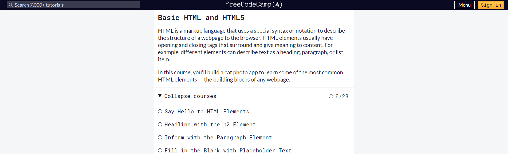
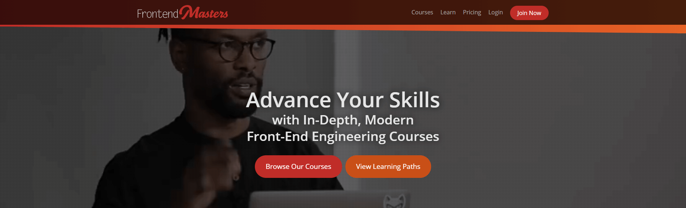
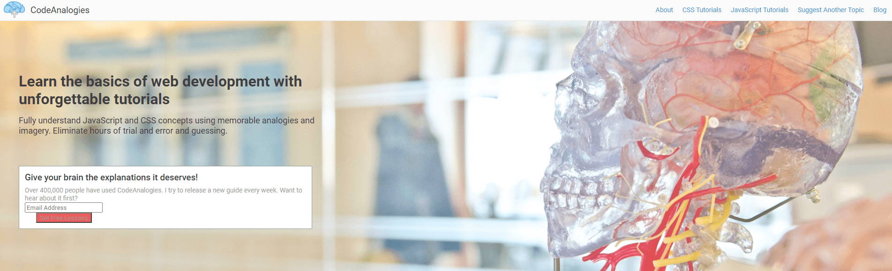
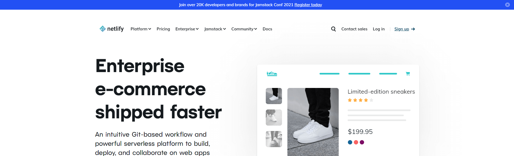
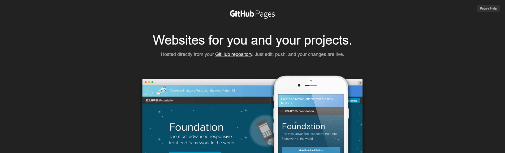
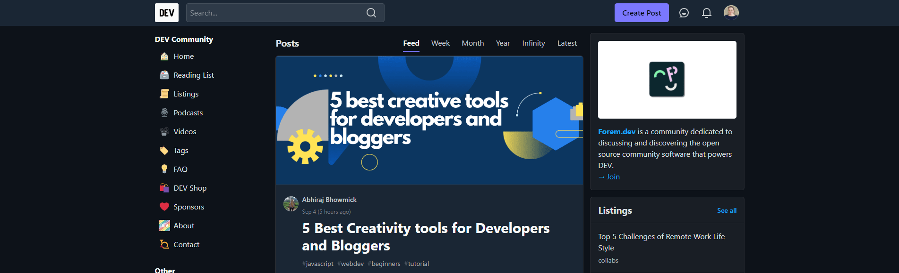
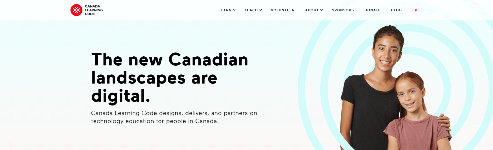

Have you seen those articles across the web with 1000+ free tools to get you started? I don't know about you, but those lists can be a little overwhelming. 

At the beginning of my coding journey, I found myself falling into this pattern:

1. "Okay, I'd like to code, but where do I start?"
2. Find a useful article with 100+ resources to learn to code for free.
3. Read through the list and open interesting links in a new tab.
4. Go through my 50+ open tabs to see if the resources actually seem useful.

Before I knew it, an hour or two had passed and I would come away with a few links and no actual progress.

Sooooo not efficient.

If you've found yourself falling into the same trap, well...this article is for you.

I've created a curated short list of resources that I recommend you use to learn Front-End Development. These resources are specifically for HTML, CSS, and JavaScript, and include other helpful tips and advice to help get you started.

## Learn to Code
There are a ton of different courses out there and you may even find yourself trying to "catch them all." But that's a sure path to a lot of uncompleted courses on your to-do list.

I suggest finding a course you like and following it through for as long as possible. You definitely want to avoid the trap of beginner course after beginner course after beginner course. Keep progressing! Learn more and more difficult things.

With that said, here are the resources I give to anyone who wants to learn how to code. These suggestions are a great way to start and see if your interests hold up.

### freeCodeCamp

[freeCodeCamp](https://www.freecodecamp.org/learn/responsive-web-design/) is an incredible community with a project-based curriculum for learning web development. Start out by earning your certificate in Responsive Web Design and go from there.

This is the resource I most often recommend first. It has an excellent curriculum and a wonderful community. And it will give you a solid roadmap to help you learn efficiently.

If you find that you prefer more structured in-class learning (like a bootcamp or certificate program), this will still give you a great head start.

### Frontend Masters

Alternatively, or even in combination with, you could check out the [free Web Development bootcamp](https://frontendmasters.com/bootcamp/) hosted at Frontend Masters. This is a 21 hour project-based course covering HTML, CSS, and JavaScript.

### CodeAnalogies

I used to teach a web dev bootcamp at the Southern Alberta Institute of Technology. One of the resources that really helped my students to grasp the harder material was [CodeAnalogies](https://www.codeanalogies.com/). 

CodeAnalogies is dedicated to breaking down difficult web development concepts through the use of memorable analogies and imagery. 

For instance, one of the articles is titled [CSS Positioning Explained By Building An Ice Cream Sundae](https://www.codeanalogies.com/csssundae/). That's a pretty neat way to learn about CSS! (And also, it makes me want ice cream.)

If you feel stuck at some point or feel like you just need a little help to make something click for you, check to see if CodeAnalogies covers the concept you're learning!

## Hosting Your Projects

While you can build websites locally (directly on your computer), you're going to eventually want to host them somewhere so you can share them with others. Here are some of the resources I've used and love for free website hosting.

### Netlify

This is what my site is currently hosted on and I love it! 

To use [Netlify](https://www.netlify.com/), you'll want to store your code using version control. GitHub is a solid choice and a lot of tutorials use it. Then, you can follow a few steps to hook up your GitHub repository to your Netlify site. Soon, your new website will be ready to share with everyone. 

Here's a [step-by-step guide on deploying on Netlify](https://www.netlify.com/blog/2016/09/29/a-step-by-step-guide-deploying-on-netlify/) to help you.

An alternative: [Vercel](https://vercel.com/)

### GitHub Pages

[GitHub Pages](https://pages.github.com/) is a great alternative to Netlify and means you can do everything from GitHub itself. [GitHub Pages has far fewer features than Netlify](https://www.netlify.com/github-pages-vs-netlify/), but it is really great for starting out. 

If you don't need more advanced features, then GitHub pages may be perfect for you. The important thing is actually launching your projects, and GitHub Pages is built-in to the GitHub code repositories you may already be using.

An alternative: [GitLab Pages](https://about.gitlab.com/stages-devops-lifecycle/pages/)

## Get Involved
It can be tempting to stay behind your computer and not share your code with others. But getting to know other people in the community and getting involved in different projects and events will help keep you motivated and growing.

Here are a few great organizations to help get you started. But don't stop there! You'll find a ton of great communities on Slack and Discord. And your local dev community may also host events and conferences.

Look around and get to know your community.

### CodeNewbie

[CodeNewbie](https://www.codenewbie.org/) is an excellent community to get involved in when you're learning how to code. They offer a community forum, weekly Twitter chats, and even a [free conference](https://codelandconf.com/)!

### Dev.to

While I recommend you start your own blog and document your progress there, you should also check out [Dev.to](https://dev.to/). Dev.to is a great site for devs to post content and share knowledge.

You can ask questions, comment on other developers' content, and more. Many devs even cross-post their blog posts to Dev.to, meaning that they write content on their own site but then also share it on the Dev.to site. 

If you decide to join the community and cross-post your writing to Dev.to, don't forget to use the Canonical URL feature to link back to your website.

### Canada Learning Code

Okay, this one is for the Canadians. I love the [Canada Learning Code](https://www.canadalearningcode.ca/) organization and have spent my time volunteering, mentoring, and teaching for them.

Their mission is to bring technology education and accessible computer science to people across Canada.

Currently their workshops are all virtual, but they may bring back in-person events in the future. Check out what they have to offer and get to know your local chapter.

## Next Steps

Once you feel comfortable with the basics of HTML, CSS, and JavaScript, you'll have a better understanding of what you like and don't like. 

From here, you can take some time to think about your goals and the type of projects you most enjoy. If you're interested in getting a job in web development, take a look at different job ads and create a list of topics you can learn and practice.

For example, you can definitely get a job as a developer with just HTML, CSS, and JavaScript knowledge, but if all the jobs you're interested in require React, then you know that's something you should spend some time learning.

If you're interested in running your own business, then you'll want to spend some time learning about marketing and invoicing in addition to any specific skills you want to offer as part of your services.

There's a lot to learn, but I promise you that we are all learning constantly. 

It can feel overwhelming when you're first starting out, but know that you're not behind. The world of web development changes frequently. But the upside of these frequent changes is that you can become an expert in new technology and practices in a much shorter period of time than you might think.