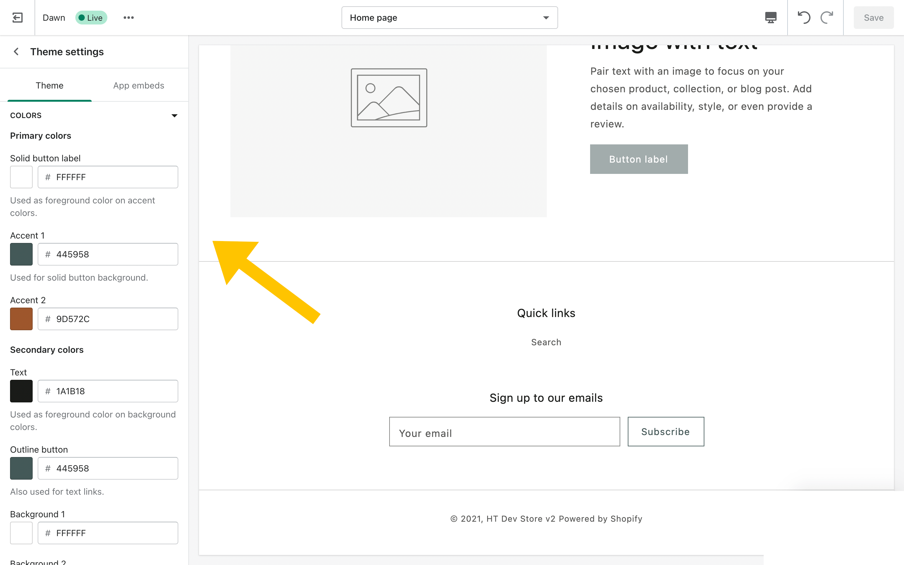

Are you interested in becoming a Front-End web developer? Or maybe you want to know a bit more about how to code so that you can tweak your site?

Want to save this reference for later? <a href="javascript:;" onclick="ml_webform_4597036('show')">Download your free PDF now.</a>

Have you seen those articles across the web with 1000+ free tools to get you started? I don't know about you, but those lists can be a little overwhelming. In my coding journey, I often found myself reading through these articles and following this pattern:

- "Okay, I'd like to code, but where do I start?"
- Find a useful article with 100+ resources to learn to code for free.
- Read through the list and click on interesting links to open them in a new tab.
- Go through my 30+ open tabs to see if the resource seems useful.
- Before I know it, an hour or two has passed and I've come away with a few links I can try for learning to code when I have more time. These links may or may not be useful once I actually sit down and find the time to use them.

But that's not an efficient use of time. Sure, you find a lot of free resources but you're trading away the time you have set aside for learning how to code.

So, what does that mean for you?

Well, this article isn't a comprehensive list of resources. Instead, this is a curated short list of resources that I would recommend you use to learn Front End Development. These resources are specifically for HTML, CSS, and JavaScript, and include some project ideas to help get you started.

I highly recommend following 1 resource until the end (I've listed a couple of them below). Once you complete it, you'll have a better idea of where your strengths and weaknesses are, and you'll be able to focus on finding more intermediate/advanced resources that can help you to round out your weaknesses.

Skipping around to different resources will mean learning the same foundational material over and over again. This will be much slower and also demotivating. You want to keep yourself interested in the material.

Another benefit of following this path is to make sure you're really interested in the topic. If you're not, you'll be able to try out a different type of coding knowing that you gave Front-End development a real shot. You may also find that self-directed learning isn't for you. If this is the case, you'll already have a leg up for any bootcamps or courses you take in the future.

## Useful Resources

### FreeCodeCamp

This is an incredible community with a project-based curriculum for learning web development. Start out by earning your certificate in Responsive Web Design and go from there.

[https://www.freecodecamp.org/learn/responsive-web-design/](https://www.freecodecamp.org/learn/responsive-web-design/)

### Frontend Masters

Alternatively, or even in combination with, you could check out the free Web Development bootcamp hosted at Frontend Masters. This is a 21 hour project-based course covering HTML, CSS, and JavaScript.

[https://frontendmasters.com/bootcamp/](https://frontendmasters.com/bootcamp/)

### CodeAnalogies

I used to teach a web dev bootcamp at the Southern Alberta Institute of Technology. One of the resources that really helped my students to grasp the harder material was CodeAnalogies. This is a website dedicated to breaking down web development topics using memorable analogies and imagery. For instance, one of the articles is titled CSS Positioning Explained By Building An Ice Cream Sundae. I highly recommend checking the site out as you're learning topics. This can help to fill out your understanding of a topic and help with the more difficult topics to learn.

[https://www.codeanalogies.com/](https://www.codeanalogies.com/)

## Projects

I fully believe that projects are the best way to learn. You will get stuck and it will feel hard, but then you will have a breakthrough and you will truly learn something. Having said that, coming up with ideas for projects can be incredibly difficult. You want something that you're actually learning from or that could make for an excellent portfolio piece. Here are some resources to help you find the right idea. Choose something that you're excited about!

### JavaScript 30

Wes Bos takes you through building 30 things in 30 days with 30 tutorials. This can be a super fun way to practice JavaScript and come out with some projects on your portfolio. At the end of this program, I'd recommend taking the most fun project for you and figuring out how to add even more to it. Maybe figure out how to add some of the other techniques that you learned in the course to add to your favorite project. 

### Your Personal Site

Even if you go for a super minimalist site with a basic About section and your contact info, try to make it fun. Check out some other portfolios and personal sites, or look on Dribbble and find things that interest you. You can build and change your site over time to learn new things as you go.

### Create an Email Template

One incredibly valuable skill is creating email templates. These often use tables for structure and tend to be fully created with HTML and CSS alone. I consider this a more advanced skill because, despite email templates using more basic HTML and CSS techniques, it requires writing your HTML in ways that are not proper for modern web development. Email platform support can be challenging as well. But if you're feeling adventurous, this could be a really great portfolio piece to showcase your HTML and CSS skills. Here's a tutorial to get you started: [https://webdesign.tutsplus.com/articles/build-an-html-email-template-from-scratch--webdesign-12770](https://webdesign.tutsplus.com/articles/build-an-html-email-template-from-scratch--webdesign-12770)

### Create a Day/Night Toggle

You've probably seen these around the web. This website has one, for example. A day/night toggle is a button that allows your visitors to swap the color theme on your site. This is great for reading at night and some people just prefer the color scheme all together. If you want to make it more advanced, learn about the [prefers-color-scheme media query](https://developer.mozilla.org/en-US/docs/Web/CSS/@media/prefers-color-scheme) to automatically turn on dark mode for your user if they prefer it (but still give them the ability to toggle it back off). You can go another step further and use JavaScript to store this information in localStorage so that your site will remember their preference when they visit again.

## Hosting Your Projects

While you can build websites locally (directly on your computer), you're going to eventually want to host them. Here are some of the resources I've used and love for free website hosting.

### Netlify

This is what my site is currently hosted on and I love it! To use Netlify, you'll want to host your code using version control (GitHub is a solid choice and a lot of tutorials use it). Then, you can follow a few steps to hook up your GitHub repository to your Netlify site. Soon, your new website will be ready to share with everyone. Here's a [step-by-step guide on deploying on Netlify](https://www.netlify.com/blog/2016/09/29/a-step-by-step-guide-deploying-on-netlify/) to help you.

### GitHub Pages

GitHub pages is a great alternative to Netlify and means you can do everything from GitHub itself. [GitHub Pages has far fewer features than Netlify](https://www.netlify.com/github-pages-vs-netlify/), but it is really great for starting out. If you don't need more advanced features, then GitHub pages may help you to get projects out in the world more quickly. And that's really what matters in the end.

## Get Involved

CodeNewbie

Dev.to

Canada Learning Code

## Next Steps

Once you feel comfortable with the basics of HTML, CSS, and JavaScript, you'll have a better understanding of what you like and don't like. 

From here, you can take some time to think about your goals and the type of projects you most enjoy. If you're interested in getting a job in web development, take a look at different job ads and create a list of topics you can practice.

For example, you can definitely get a job as a developer with just HTML, CSS, and JavaScript knowledge, but if all the jobs you're interested in require React, then you know that's something you should spend some time learning.

If you're interested in running your own business, then you'll want to spend some time learning about marketing and invoicing in addition to any specific skills you want to offer as part of your services.

If you're not sure yet what your goals are or you want to keep practicing your skills while you're figuring things out, here are some suggestions.

If you're a fan of CSS, spend some time learning about CSS animations to add fun and delightful experiences to the web. If you're a fan of JavaScript, think about learning something like React to help you create fun web apps.

Some other topics you may want to study include:

- accessibility
- web performance
- user experience

There's a lot to learn, but I promise you that we are all learning constantly. It can feel overwhelming when you're first starting out, but just know that you're not behind. The world of web development changes frequently, and it can feel like you'll never catch up. But the upside of these frequent changes is that you can become an expert in new technology and practices in a much shorter period of time than you might think.

Want to save this reference for later? <a href="javascript:;" onclick="ml_webform_4597036('show')">Download your free PDF now.</a>

