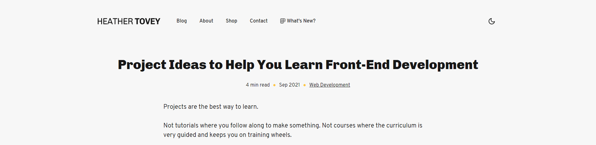
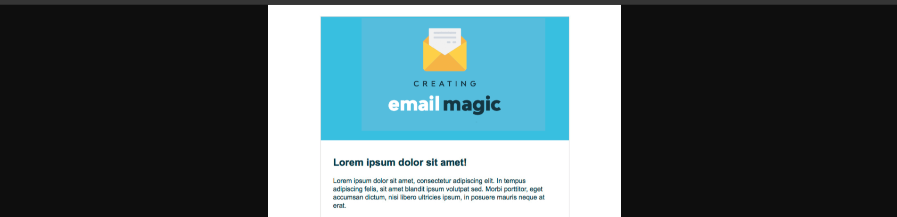
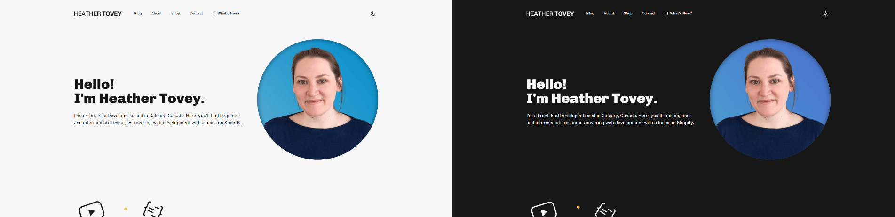
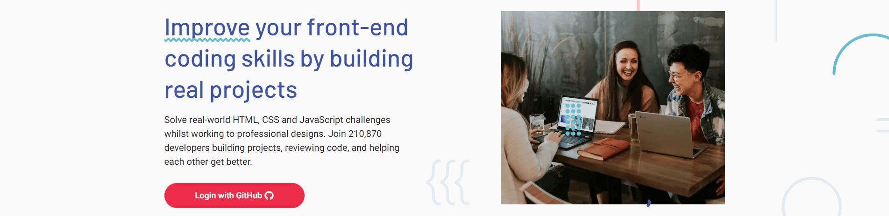

Projects are the best way to learn.

Not tutorials where you follow along to make something. Not courses where the curriculum is very guided and keeps you on training wheels.

Projects. Your own projects using your own ideas.

You will get stuck and it will feel hard. We have all been there. But pushing through to a breakthrough is when you truly learn something that will stay with you.

Having said that, coming up with ideas for projects can be incredibly difficult. You want a project that is challenging enough so that you're learning, but not so difficult that you give up and walk away. You want projects that could be good portfolio pieces too.

So here are a few ideas to get you started. Choose something that you're excited about!


## JavaScript 30


In JavaScript 30, Wes Bos takes you through [building 30 things in 30 days with 30 tutorials](https://javascript30.com/). 

This can be a super fun way to practice JavaScript and come out with some projects on your portfolio. 

With that said, the videos themselves walk you through how to create the project. So to get the most use out of this, I'd recommend trying your hand at the project before watching the video, just to see how far you can get on your own.

Another thing you can do is to go back after you've watched the videos, choose a few projects that you liked the most, and add on to them. If you put these types of projects in your portfolio, you should take some time to customize them first. 

What features will you add? What design tweaks will you make? How will you make it a better experience?

## Your Personal Site



Even if you go for a super minimalist site with a basic About section and your contact info, try to make it fun. 

Check out some other portfolios and personal sites, or look on [Dribbble](https://dribbble.com/) and find things that interest you. You can build and change your site over time to learn new things as you go.

## Create an Email Template



One incredibly valuable skill is creating email templates. And you can do this with HTML and CSS alone!

Email templates often use ```tables``` for structure instead of the more modern techniques we have at our disposal. So if you go down this road, prepare to either love it or hate it.

If you're feeling adventurous, this could be a really great portfolio piece to showcase your HTML and CSS skills. And from what I've seen, there are always designers looking to hire someone who specialize in developing email templates.

To get started, check out [Build and HTML Email Template From Scratch](https://webdesign.tutsplus.com/articles/build-an-html-email-template-from-scratch--webdesign-12770). But remember, don't just follow the tutorial. Make it your own. Can you recreate a template from one of your favorite newsletters? How might you change it?

## Create a Day/Night Toggle



You've probably seen day/night toggles around the web. This website has one, for example. 

A day/night toggle is a button that allows your visitors to swap the color theme on your site. This is great for reading at night and some people just prefer the color scheme all together. 

If you want to make it more advanced, learn about the [prefers-color-scheme media query](https://developer.mozilla.org/en-US/docs/Web/CSS/@media/prefers-color-scheme) to automatically turn on dark mode for your user if they prefer it. Sidenote: you should still give them the ability to toggle it on and off.

You can go another step further and use JavaScript to store this information in localStorage so that your site will remember their preference when they visit again.

For more information about dark mode in web development, check out [A Complete Guide to Dark Mode on the Web](https://css-tricks.com/a-complete-guide-to-dark-mode-on-the-web/).

## Frontend Mentor Challenges



[Frontend Mentor](https://www.frontendmentor.io/challenges) is a website devoted to front-end web development project ideas. If you're struggling to find something fun to build, take a glance through their offerings!

You can filter by difficulty (Newbie, Junior, Intermediate, Advanced, and Guru) and languages (HTML & CSS, JS, API).

The free version will get you all of the project ideas and project briefs. Many of the challenges will also give you design files, a style guide, image assets, a README file to get you started and even an HTML file with pre-written content, all for free.

If you find yourself wanting more, the Pro version unlocks additional features like Sketch and Figma design files, as well as assets for Premium challenges. 

## Next Steps
Choose 1 project idea that appeals to you. Then, get started!

To get the most out of the project, spend some time before you start to code thinking about what all you need to make this project come to life.

- What components will you need to build?
- How many pages are there?
- Could you benefit from using a framework or library or can you get away without them for now?

These notes and your thought process could make for an amazing case study for your portfolio.