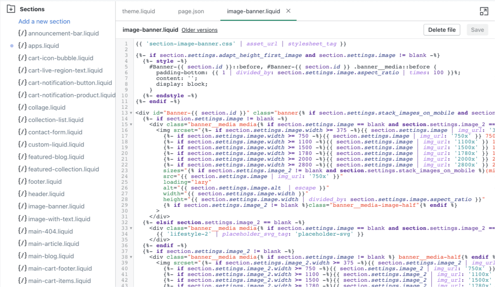

A Shopify theme is a very specific set of files that work together to create what visitors see when they visit the store. So if you're building a Shopify theme, you need to know what these files are and how they all fit together.


So where can you find these files? From your online store, you can Navigate to Themes. Once you see the list of themes on your store, you can hover over the Action button and choose Edit Code.


Now, you'll have access to the Shopify Code Editor. This is where you'll find all the files you'll need to add new features and customize your theme.

## Shopify's Theme Structure


The files in the Shopify Code Editor are broken down into 7 folders:
- Layout
- Templates
- Sections
- Snippets
- Assets
- Config
- Locales

Let's go over each one and how they work together.

### Layout

This is where you keep the code that lives on every page. In the Dawn theme (as an example), the 2 main layout files are:

- theme.liquid
- password.liquid


In these liquid files, you'll find links to the scripts and styles that run your website. You'll also find global sections like your announcement bar, header and footer.

To make these layout files work, they must have the following Liquid code in them (or else you'll see errors).

#### ```{{ content_for_header }}```
This adds important scripts that Shopify needs to run including analytics scripts. It must be placed between the opening and closing ```<head>``` tags in your layout file.
#### ```{{ content_for_layout }}```
This handles placing all the content that you are coding in the template files (which we will get to) into the layout. It must be placed between the opening and closing ```<body>``` tags.

It's important to note that ```theme.liquid``` is used by every template on your site by default. If you want to create alternative layouts (like the password.liquid layout), you need to specify which layout file you're using in the template file.

You can use additional alternative layout files in order to create different layouts. For example, if you want a landing page that removes the header and footer, you can do that by creating an alternative layout that doesn't include the header and footer sections.

### Templates

Template files hold the code that determines the content that is displayed on a page. You may have template files for:

- homepage
- product pages
- collection pages
- blog pages
- single blog posts
- and more


These template files let us choose the sections that show up for that specific template.

You should have a different template for each type of page on your site. For example, you don't want to use the same template for your products page and your homepage. These are 2 different types of pages entirely.

But you don't have to stop there. You can create additional templates if you want to vary up the content displayed on a type of page. For instance, most of your products may use the same product template, but you can create an alternative template to showcase your main product a bit differently.

Template files can be .liquid or .json files. .json files were introduced as an option in July 2021 and these are what enable Sections Everywhere. Going forward, you will see .json files referenced a lot, but .liquid files are still used (and you'll see them a lot in older tutorials).

Briefly, Sections Everywhere allows us to add, hide/show, and reorder sections on any page template. Before July 2021, this was a feature only available on the homepage. 

In Dawn, you'll find that most of the template files are .json, but simple pages like account-related pages that don't benefit from the added flexibility of Sections Everywhere still use .liquid files.

<div class="callout">
  <p class="callout__info">If you're curious what Sections Everywhere looks like, check out the video at the bottom of my article "<a href="/blog/shopify-theme-editor/#bonus-new-online-store-20-features">Getting Started with the Shopify Theme Editor</a>".</p>
</div>

### Sections

Sections are an incredibly important part of Shopify theme development. Sections are reusable components (or sections, so to speak) that can be added to templates and customized within the Theme Editor. 



Typical sections you may find on a store include:

- Hero banner
- contact form
- newsletter sign-up
- product recommendations

Sections often include their own section settings, and this is a common area of customization in Shopify theme development.

### Snippets

Snippets are generally small reusable bits of code that you'd like to use across your site. 


Snippets are often created for heavily reused code like:

- product cards (you may find these in featured product sections, collection pages, product recommendations, etc.)
- blog cards (you may find these in Recent Article sections, on the main blog listing page, and maybe even the 404 page)
- svg icons (these are typically used everywhere across the site like for a cart in your header, icons on your product pages, and so many more places)
- social media links (often found in the footer, header, contact pages, blog posts, etc.)

Unlike Sections, snippets do not have their own settings, but they can access the settings of sections they are embedded into.

For instance, you may have a section that shows all of your product recommendations. Inside that section, you can use a snippet to display each product's information in a nice and tidy product card. The section is where you might choose which products to display. And that information can be passed into the snippet so that the snippet displays the correct product in the right place.

### Assets


Assets are where you'll find the theme's CSS and JavaScript files. Sometimes, you may include images (background images used to add texture or patterns across the site, for instance) or custom font files here too.

### Config


The config files are used to create and store the theme settings. You can find the Theme Settings in the Theme Editor when you go to Customize.

settings_schema.json is used to create new settings that you'll find in Theme Settings.

settings_data.json is used to store the choices made in Theme Settings and is automatically populated when changes are made. 

### Locales


This folder holds all the .json files related to translating the text in your theme and the Theme Editor. en.default.json is usually set as the default file which sets the store language to English.

## Next Steps
With time, you'll get used to how Shopify themes are set up and get comfortable building different layouts, templates, sections, and snippets.

While you're learning, get in there and check out how your theme is currently built. Follow the rabbit trail and see what Layouts are being used for your Templates. See what Sections are added to the different templates. And then, see where the different Snippets are being used throughout the theme.

And if you want more in-depth information, there's no better resource than Shopify's documentation covering their [Theme Architecture](https://shopify.dev/themes/architecture).