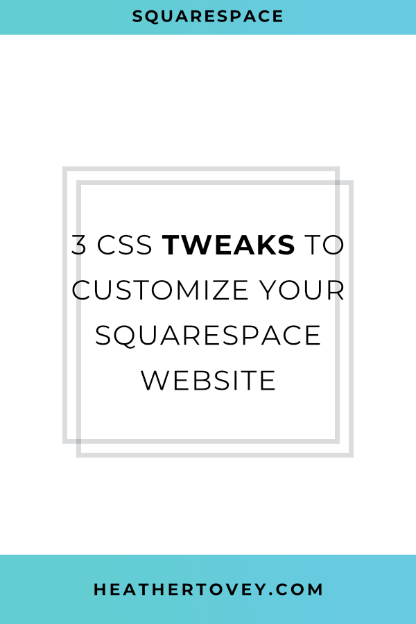
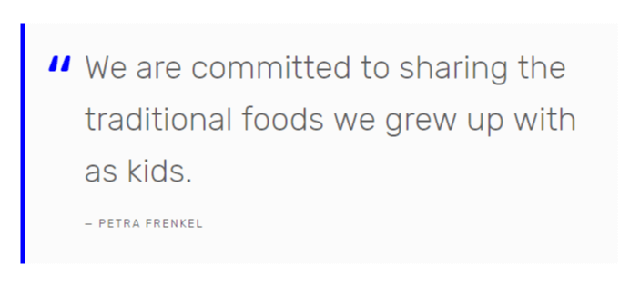

Brine is a popular Squarespace template. There’s a lot of functionality there and a lot you can do with it.

But with CSS, you can do even more!

Here are 3 of my favorite “simple” Squarespace CSS code snippets. These were tested on Brine, but may very well work on other templates too.

Have fun and make your Squarespace website more “on brand.”



## Fixed Header

A header that moves off the screen as you scroll down the page is all well and good, but sometimes you want a fixed header that stays on the page as you scroll down.

In Squarespace, there are 2 different headers: one for tablet/desktop, and another for mobile. In this CSS snippet, we’re only making the desktop header fixed because the mobile can be changed in **Design > Site Styles**.

To fix your header to the top of the page, drop this code in **Design > Advanced > Custom CSS**.

```less
@media screen and (min-width: 640px) {
    body {
        padding-top: 102px;
    }

    .Header--top {
        position: fixed;
        width: 100%;
        border-bottom: 1px solid #ddd;
        z-index: 10;
        top: 0;
    }
}
```

## DIY Cover Pages

The cover pages offered through Squarespace are amazing, but require that you follow their strict design formula. Sometimes you need more flexibility.

One way to design a page exactly the way you want is to use a regular page and then hide the distracting header, footer, announcement bar and cookie banner on just that page.

For an example of what this might look like, check out my [newsletter sign-up page](/sign-up).

To make your DIY cover pages less distracting, drop this code in that particular page’s **Settings (the cogwheel) > Advanced > Page Header Code Injection**.

```html
<style>
.Header, 
.Footer, 
.Mobile-bar,
.sqs-announcement-bar-dropzone,
.sqs-cookie-banner-v2 {
    display:none !important;
}
</style>
```

## Style Your Blockquote

The blockquote block provided by Squarespace is a great way of making your blockquotes stand out from the rest of the content on your page.

However, it’s a little plain. If you want it to stand out, here’s some code to make it your own.



Just drop this code in **Design > Advanced > Custom CSS**.

```less
.sqs-block-quote .sqs-block-content {
    border-left: 5px solid blue;
    background: #fbfbfb; 
}

.sqs-block-quote figure {
    padding: 20px;
}

.sqs-block-quote blockquote {
    padding: 0 20px 0 45px;
    position: relative;
}

.sqs-block-quote blockquote span {
    font-size: 100px;
    color: blue;
    position: absolute;
    top: 24px;
    left: 0;
}

.sqs-block-quote blockquote span:last-child {
    display: none;
}

.sqs-block-quote figcaption {
    padding-left: 45px;
}
```
