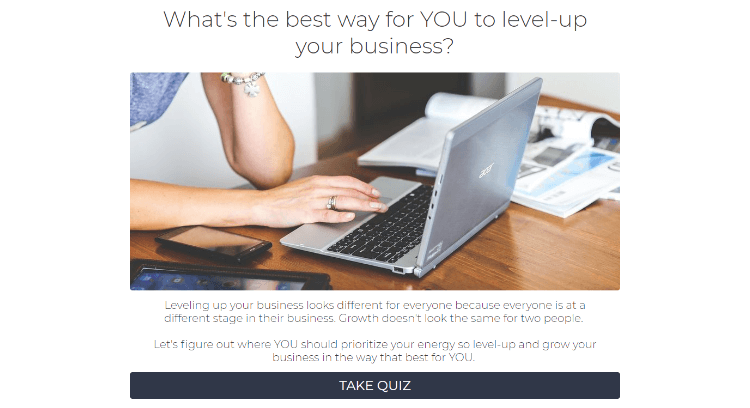
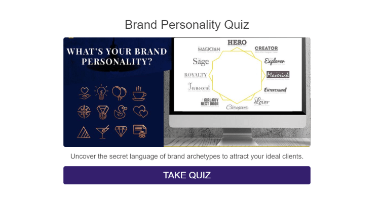

* * *

_Disclaimer: This article includes affiliate links for Interact. I became an Interact Partner/Affiliate after checking out their service, and I promise that I am sharing these links with you because I actively use Interact myself and can highly recommend their service. If you make a purchase through these links, I make a commission at no extra cost to you._

* * *

I love quizzes!

When I was younger, I could spend hours reading magazines and, inevitably, I took a lot of quizzes.

**"What's your theme song?"** ("Walking on Sunshine", which still gets stuck in my head randomly.)

**"Are you more Type A or Type B?"** (More Type A...I'm a perfectionist, and it's a struggle sometimes.)

**"How much do you really know about fashion?"** (Turns out...not much.)

Now that I've grown up a bit, I still find myself drawn to quizzes, many of which are related to my career. And that's what led me to research how quizzes could help me to generate business.

Quizzes are great for getting people to interact with your site and learn more about your brand or the services you offer. I highly recommend you try placing one on your website!

But writing one can be difficult. How do you decide what the topic of your quiz should even be?

I struggled for a bit when I wrote [my quiz](https://www.tryinteract.com/share/quiz/5b61e04af8ef7b0014a473ca), so today I'm sharing some tips, examples, and 30 quiz ideas for designers. I hope these help to provide inspiration for creating your very own quiz!

## Tips for Writing a Quiz

First things first, let's talk about how to go about writing a quiz.

1. **Find a topic idea.** Think about your target audience. What do they most want to know about? What content brings people to your website already? What questions do you already use to qualify your leads?
2. **Start with the results first.** What outcomes do you want to lead your readers to?
3. **Write 5-10 quiz questions.** You want to keep your quiz short enough to hold your reader's interest. Use this [Quiz Content Worksheet](http://help.tryinteract.com/getting-started/quiz-content-worksheet) provided by Interact to stay organized.
4. **Find interesting and relevant photos.** The best quizzes involve stimulating visuals to go with your words.
5. **Build your quiz!** Choose a quiz platform that works for you. I chose to use [Interact](https://www.tryinteract.com#oid=94736_4020) (affiliate link) several months ago after seeing the brand pop up on a couple of quizzes that I enjoyed taking. I've had a great experience and will be sticking with their service.
6. **Connect your quiz results to your newsletter.** Get interested readers onto your newsletter and offer them more valuable content made especially for them.
7. **Embed your quiz onto your website.** You can embed your quiz directly on your website to help keep your readers on your site longer. Let people know you have a quiz! Don't hide it. Encourage people to try it out.
8. **Fine tune your quiz over time.** If the quiz platform you choose to use has analytics (Interact does), use those statistics to find confusing questions or unexpected results. Make your quiz better as you get more results.

## 30 Quiz Ideas for Designers

Now that you have an idea of how to go about creating a quiz, here are some quiz ideas to help you brainstorm. Take these suggestions and tweak them for your particular audience!

1. Which social media platform is for you?
2. What's your marketing personality?
3. What platform should you use for your website?
4. What's your design personality?
5. What color palettes should you use?
6. What's your photography style?
7. Which type of logos are you most drawn to?
8. What's your copywriting voice?
9. Do you need a new website?
10. What style of website is right for you?
11. What is your business brand type?
12. What type of blogger are you?
13. Is blogging right for you?
14. What type of articles should you write?
15. What kind of marketing should you do?
16. How will you make money online?
17. What's your social media strength?
18. How productive are you?
19. Which Squarespace template should you use?
20. How can you level up your business?
21. Which service is right for you? (Help your potential clients choose one of your services.)
22. Should I DIY my website or hire a designer?
23. Is your website user-friendly?
24. What's the missing piece in your business?
25. Niche quizzes (What type of entrepreneur are you? What type of yoga teacher are you? What kind of bookkeeper are you?)
26. How well do you know your target audience?
27. How well is your website doing?
28. What type of newsletter opt-in should you create?
29. Does your website need a sidebar?
30. What type of designer should you work with?

## Quiz Inspiration

I don't know about you, but I'm definitely more of a visual and hands-on learner. If that describes you, here are a few quizzes that I particularly enjoyed taking.

**What's the best way for YOU to level-up your business?**

Created by the **Alexander Design Co.**, this quiz is all about learning how to grow your business based on what stage you're currently at in your business. Find out your strengths and weaknesses, and then check out the resources tailored to your particular needs.

**[What is your innate brand advantage?](https://www.kayeputnam.com/brandality-quiz/)**

**Kaye Putnam**'s quiz is how I ended up getting really interested in learning about branding and brand archetypes. Take the short quiz to discover your brand's unique strengths and the psychological triggers you can use to attract more of your ideal clients.

## Use a Quiz to Generate Business

If you're looking for ways to generate more business, try adding a quiz to your website. Quizzes can help you:

- engage new readers
- teach your readers about your services
- qualify your leads
- get people talking about your company
- and more!

Use a platform like [Interact](https://www.tryinteract.com#oid=94736_4020) (affiliate link) to make setting up your quiz easier and faster. Use your platform to connect your quiz to your newsletter and use the analytics provided to make your quiz better over time.

Armed with the tips, ideas, and inspiration from this article, you're well on your way to creating the ideal quiz for your business.