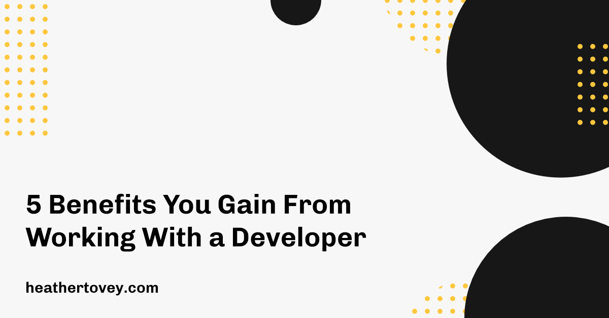

If you've seen any of my other articles, you may have noticed that I love to create [coding snippets](/blog?tag=code%20snippets) for others to use. I love solving problems, building websites, and writing custom code.

But it's not everyone's cup of tea. That's why I often work with designers to bring their designs to life.

Have you ever considered working with a developer on your client projects? If you haven't or you're on the fence, take a look at these 5 reasons to work with a developer on your design projects before making a decision.

  

  

## 5 Benefits From Working With a Developer

### Benefit #1: Save Time

We all have our own natural strengths and weaknesses. You're really great at design! Maybe you're also excellent at organizing projects and communicating with clients. But no one person can be amazing at everything.

By working with a developer, you can pass off time-consuming tasks to them, and they can complete them faster and with more expertise.

### Benefit #2: Make More Money

If you work with a developer, you can create the space for you to focus more directly on your clients and their needs. You can offer more value to your clients by spending time on what you're good at. And offering more value means you can charge more.

If you choose to work with a developer, don't make the mistake of paying them out of pocket. Add their fees to your project fees. Your client pays for the increased value and the extra people working on their project.

### Benefit #3: Enjoy Your Work More

How would you feel if you didn't have to do the mundane or difficult tasks that you don't enjoy? Instead, you get to go to work excited about the design work you're going to do that day!

Working with a developer means that you no longer dread the less than exciting tasks that are necessary to run a web design business. Your developer, on the other hand, loves those tasks. So you get to enjoy your work more, and you get to work with someone who is also passionate about your project.

Win, win.

### Benefit #4: Encourage Your Creativity

If you have limited coding skills, you may find yourself designing around the limitations of a particular template. Or maybe you find yourself relying on coding snippets that you find around the internet. And, unfortunately, those are never perfectly made for your project.

It can be incredibly demotivating to realize you have to change a lot of your design because you simply can't make those features happen on your own.

But working with a developer unlocks your creativity. You can design and be completely creative knowing that your developer has a better idea of how to make things work. And you can trust that they'll let you know when something is truly impossible.

No more designing around so many limitations.

### Benefit #5: Get Access to Expert Advice

Everyone benefits from having someone to talk to about how to solve problems.

Having an issue with a client request? Talk to your developer about possible solutions.

Not sure how to design a feature to look beautiful on mobile devices? Talk to your developer about best practices.

Want advice about how to make your website more people-friendly or accessible? Talk strategy with your developer.

Developers have experience working with the same types of clients as you, but can often offer a different perspective. And bonus! You know they have your best interests at heart.

## Consider Working With a Developer

If this list of benefits has you interested in working with a developer, that's great! You're one step closer to making your web design business even greater and more efficient.

But a note of caution. Don't team up with just any developer. Make sure to do your research to avoid partnering up with someone who doesn't mesh well with your personality, goals, and work style.

Check out their work, read their articles, talk to them on social media, and see how they work with others. By investing in the process, you can find a strong developer who truly cares about your clients and their projects.
