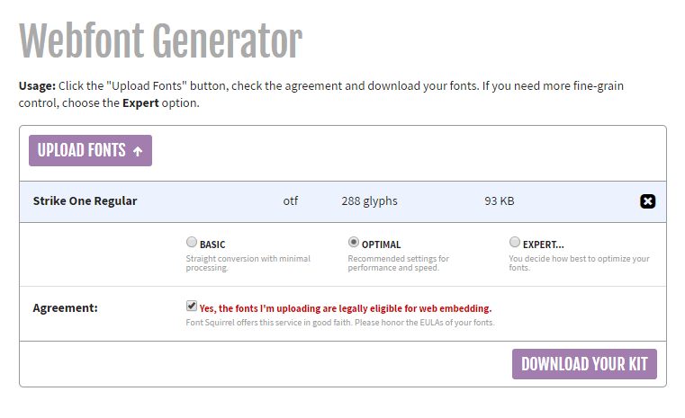
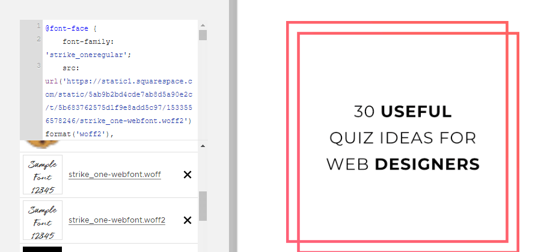

You want the website you're designing to stand out and look and feel on brand, right?

Well one way to do that is to add custom fonts to the website! Unfortunately, while Squarespace provides solid font options straight out of the box, every other website is using those fonts too.

So what's a designer to do? Let me show you how to add and use custom fonts on Squarespace websites in 5 steps.

## How to Use Custom Fonts

### 1. Choose your font.

In particular, choose a font that you have the license for and is professional-looking.

Many typefaces are only licensed free for personal use or require payment for the license. Some licenses only cover using fonts in print. Make sure to read the fine print and stay on the legal side of using typefaces.

And beware of free fonts that aren't high-quality. Test them out and make sure you want to go with them.

### 2. Upload font to Font Squirrel. 

Once you're happy with your selection, use the [Webfont Generator at Font Squirrel](https://www.fontsquirrel.com/tools/webfont-generator) to make sure your custom font will work across all browsers.



Upload your font, choose Optimal, and agree that you're uploading fonts that you're allowed to use on the web. Then, click download and get access to your new webfonts.

### 3. Upload new fonts to Custom CSS.

Go to **Design > Custom CSS > Manage Custom Files** and upload the 2 font files Font Squirrel provides in their download.



The files you'll want end in .woff and .woff2. You'll want to use both so that your custom fonts show up appropriately across all browsers and on mobile.

### 4. Add support for your new fonts.

Once you've uploaded your fonts to your website, you still need to tell your website you want to use them! In **Design > Custom CSS**, add the following code.

```less
@font-face {
    font-family: 'your-font-name';
    src: url('Woff 2 URL') format('woff2'),
         url('Woff URL') format('woff');
    font-weight: normal;
    font-style: normal;
}
```

Next, swap out **your-font-name** with the font name you want to use.

Highlight **Woff 2 URL** in the above code and click on the custom .woff2 font file you uploaded earlier in **Manage Custom Files**. This will automatically insert the URL you need. Do the same with **Woff URL**. _Make sure to leave the quotation marks around the URL._

### 5. See your new fonts in action!

Now you'll need to decide where and how you want to use your new custom fonts.

**Custom Headings**

If you want to use them for all headers, you could add the following code:

```less
h1, h2, h3 {
    font-family: 'your-font-name';
}
```

Remember to change out **your-font-name** with the name you chose.

**Emphasize Words**

If you want to add custom fonts to only particular words, you can do this with a Markdown block.

## This is an H2 heading with custom fonts on some words.

To do this,

1. add some content to a Markdown block
2. add a `<span>` tag around the words you want to emphasize
3. give that `<span>` tag a `class`
4. create custom css for that class

To create the above example, I added the following to a Markdown block.

```md
This is an H2 heading with <span class="custom">custom fonts</span> on some words.
----------------------------------------------------------------------------------
```

Once you've created your content, add the following code to **Design > Custom CSS**.

```less
.custom {
    font-family: "your-font-name";
}
```

Remember to change out **your-font-name** with the name you chose.

You can then use this same class across your website for any place you want to use that custom font. This way, if you decide to change the font to another one in the future, you can easily do this directly in Custom CSS in one go.

To see this in action, check out the headings on [my homepage](https://heathertovey.com).

## Customize Your Squarespace Website

Don't settle for cookie cutter font choices. With custom fonts, you can make your website stand out and better attract your target audience.

Play around with adding custom fonts to different parts of your site. To get you started, here are a few places where you'll often find custom fonts:

- logos
- headings
- emphasized words in headings
- image blocks
- across the entire website! You don't need to limit yourself to Google fonts.

Have fun making your website stand out.
