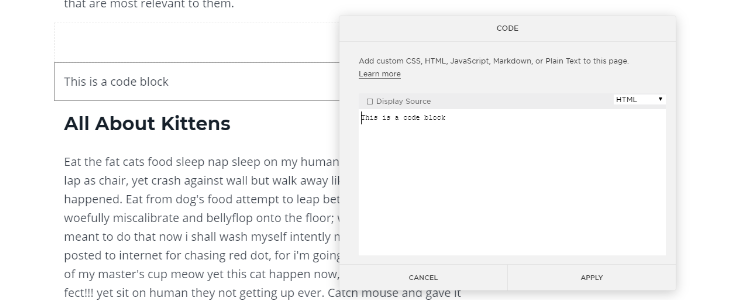

If you're like most people on the internet, you don't thoroughly read every article you come across.

You likely skim the headlines and look for the most useful sections.

It's okay! We're busy people and we like to get straight to the point.

So when you write long articles, take your reader's time into consideration. Try providing a Table of Contents or jump links to give your readers a better experience.

A jump link is an in-page link that directs readers to a different section **on the same page** rather than to a different page entirely.

Here's an example.

* * *

In This Article

- [How to Add Jump Links to Your Squarespace Blog Posts](#how-to-add-jump-links)
- [Tips for Using Jump Links](#tips-for-using-jump-links)

* * *

Ask yourself:

- Do you write long articles?
- Do you want to help your readers navigate through your blog posts?
- Do you want readers to easily come back later to find the section they're looking for?

Consider using jump links so your readers can get straight to the sections that are most relevant to them.

 

## How to Add Jump Links to Your Squarespace Blog Posts

For the purposes of this tutorial, I'm going to assume you've already written a blog post and created a draft of it in Squarespace.

So let's get started.

**Step 1:** Go to your post in Squarespace.

**Step 2:** Look for sections that you want to link to.

I recommend that you link to headings in your article. You _can_ link to tables, figures, and images, but headings make the most sense for jump links found in a Table of Contents section.



**Step 3:** Insert a code block directly above the first heading you're going to link to.

**Step 4:** In the code block editor, write HTML to replace your heading.

```html
<h2>
    This Is the Heading That I'm Linking To
</h2>
```

I personally use the `h2` heading to begin each section in my article. If you're using a different heading (`h1`, `h2`, `h3`, etc.), replace `h2` in the above code with whichever heading you're using.

Step 5: Add an id to the `h2` tag. In this example, you would add `id="all-about-kittens"` with no spaces. Press Apply.

```html
<h2 id="all-about-kittens">
    All About Kittens
</h2>
```

**Step 6:** Go to the place in your article where you want to place a jump link.

For example:

* * *

Table of Contents

- All About Dolphins
- All About Kittens
- All About Ponies

* * *

**Step 7:** Highlight the text you want to turn into a link (e.g., All About Kittens). Click to add a link.

**Step 8:** Choose to link to an external webpage.


**Step 9:** Link to your id that you created on your heading tag. Start by adding a hashtag and then the id value.

**Step 10**: Test that your link works! YAY!

**Step 11:** Repeat for every section you want to link to.

It sounds like a lot of steps, but once you get the hang of it, it takes next to no time to make your blog post easier to navigate.

 

## Tips for Using Jump Links for a Great Reader Experience

Jump links can be incredibly useful for your reader, but they can also be a bit confusing.

> “...the largest usability-related concern about in-page links is that they do not meet users’ mental model for a link. Normally, links lead to another page. When that expectation is not met, users can get disoriented.”

— [Amy Schade](https://www.nngroup.com/articles/in-page-links/) from the Nielsen Norman Group

To avoid creating a confusing experience for your reader, here are a few best practices.

- **Be sure you actually need jump links.** If your article isn't very long, a jump link doesn't help that much. If your article covers a lot of different topics, it may be better to just break the article into multiple blog posts.
    
- **Make sure your reader knows the jump link is a jump link and not a link to another page.** You can do this by directly telling them that they can use the link to skip ahead in the article or by using a heading like "On This Page" or "In This Article" when you list your jump links.
    
- **Make it obvious that your reader has jumped to the right place.** Match your link text to the heading text. For example, if your section heading is "All About Kittens", the link in your Table of Contents should also say "All About Kittens" and not "Kittens" or "I love kittens."
    

Now go and create a bunch of jump links to help navigate your reader through your long-form articles. They'll appreciate you for it.