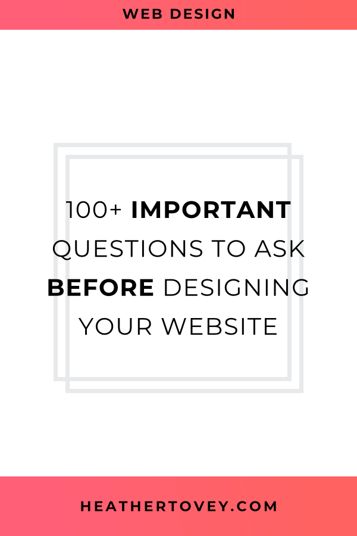

Why do you want a website?

That's an an important question you need to ask before designing your website.

If you don't ask the right questions before starting the design process, you could be left with a website that is **useless**. Or worse, a website that **turns away** your best potential clients.

Do yourself a favor and take the time to think about your target audience and your website's goals before designing your website.

To help you do that, I've created an exhaustive list of questions that will cover:

- who you're marketing to
- what kind of website you need
- how to design the best website to meet your business goals.

It's likely that you already know the answer to many of these questions. Take a minute to write down the answers so that you can better communicate your website goals and needs with others.

Whether you choose to DIY your website or work with a designer, be sure to go over these questions **before** you start the design process.

## 100+ Questions to Ask Yourself Before You Design Your Website

### Basic Information about Your Business

1. What is your business name?
    
2. What does your business do?
    
3. How did you get into this business?
    
4. How long have you been in business for?
    
5. What qualifications do you have?
    
6. What is the size of your company? Solo or team?
    
7. What are your core business values?
    
8. What are your business goals?
    
9. What products and services do you offer?
    
10. How do you get products and services to your clients?
    

### Basic Information about Your Website

1. Why do you want a website?
    
2. What problems are you having that you think a website will solve?
    
3. What is your #1 overall website goal?
    
4. What domain name will you use for your website?
    

### Current Website

1. Do you already have a website?
    
2. What do you like or dislike about your website?
    
3. What metrics do you track on your current website?
    
4. What are your top-performing pages?
    
5. What are your lowest-performing pages?
    
6. What is the bounce rate for your site?
    
7. How many pageviews do you get each month?
    
8. How long do people spend on your site on average?
    
9. How fast is your current website?
    
10. Is your website mobile-friendly?
    
11. How many leads do you receive each month?
    
12. Where does most of your website traffic come from?
    
13. What functionality on your current website do you want to keep on your new website?
    
14. Do you have access to usernames and passwords for all of your current web hosting and website accounts?
    
15. Will you be moving from your current platform to a new website platform?
    

You might also like: [Is It Time to Redesign Your Website?](/blog/redesign-your-website)

### Target Audience

1. Who is your target audience?
    
2. What is their general age group?
    
3. What gender(s) are you focusing on?
    
4. Where does your target audience live?
    
5. What type of education does your audience have?
    
6. What industry does your audience work in?
    
7. What level of income does your audience have?
    
8. What type of media does your target audience consume? (TV, books, magazines, online news, social media, etc.)
    
9. Can you list any specific favorite media?
    
10. What do people from your target audience do in their free time?
    
11. What are the purchasing habits of your target audience?
    
12. What problems does your target audience have?
    
13. How can you help them solve their problems?
    
14. What type of content does your target audience want to read?
    

### Competitors

1. Who are your competitors?
    
2. What are they doing well at?
    
3. Where could they improve?
    
4. What do you like about their websites?
    
5. What do you hate?
    
6. Why should people do business with you rather than your competitors?
    

### Branding and Web Design Preferences

1. Do you already have brand guidelines in place?
    
2. Are you already using materials that your new website needs to match (lead magnets, postcards, posters, etc.)
    
3. What is your brand archetype?
    
4. Do you have a logo?
    
5. Do you have color preferences?
    
6. Have you created a mood board?
    
7. What web design styles do you love?
    
8. What web design styles do you hate?
    
9. What brand and personality do you want your clients to associate with your business?
    
10. What fonts do you love?
    
11. What fonts do you hate?
    
12. What shapes or patterns would you like to see on your website?
    
13. What textures do you like?
    
14. What are 5 websites that you love?
    
15. What design choices do you love about these websites?
    
16. What design choices do you dislike?
    

### Website Functionality

1. When do you want to launch your website?
    
2. How much are you willing to invest into the design and development of your website? What's your budget?
    
3. Do you need a small website to get up and running now or a larger, focused site design/redesign?
    
4. Will you be selling products or services directly on your website?
    
5. Will you be blogging?
    
6. Will you allow comments on your website?
    
7. Do you need an events calendar?
    
8. Do you have a newsletter?
    
9. Do you require a membership-only section?
    
10. Does your website need to support multiple languages?
    
11. Do you need printer-friendly options? For example, recipe sites often offer a printable version of their recipes.
    
12. What other features do you need on your website?
    
13. What features do you **not** want on your website?
    
14. What do you want visitors to do on your website? Choose 1 main goal and a max of 2 secondary goals. Examples include:
    
    - Purchase services or products
        
    - Share content on social media
        
    - Participate in an event
        
    - Subscribe to your newsletter
        
    - Contact you
        
    - Join a Facebook group
        
15. What specific pages do you need on your website?
    
16. What important information should be displayed on every page (usually in a footer)?
    
17. How many pages will your new website have when launched?
    
18. Do you have a sitemap prepared?
    
19. What is the ideal path your target audience should take from landing on your website to buying your services or products?
    
20. Which pages do you want in your navigation?
    
21. What does a successful website mean to you?
    
22. How will you measure its success?
    
23. Do you have a preference for website platform? (Squarespace, WordPress, and Shopify are all popular choices)
    
24. Do you have a template or theme that you want to use?
    
25. Do you have specific accessibility requirements that go beyond the [Web Content Accessibility Guidelines](https://www.w3.org/WAI/standards-guidelines/wcag/)?
    

You might also like: [How to Make Your Website More User-Friendly (+ Free Checklist)](/blog/make-your-website-user-friendly)

### Additional Functionality

1. Do you have a Google Analytics account?
    
2. Do you have a business email address?
    
3. Do you have social media accounts?
    
4. Do you need graphics for social media?
    
5. Are you offering lead magnets for people to subscribe to your newsletter?
    
6. Have you created any lead magnets or do you need to create some?
    
7. What other 3rd-party integrations do you need or want to connect to your website?
    
8. Do you have a plan in place for maintaining your website after it is launched?
    
9. Will you run ads on your website?
    
10. What key phrases do you want to rank for in search results?
    
11. Will you need to announce that you use cookies on your website?
    

You might also like: [How to Improve Squarespace SEO with Google Search Keywords](/blog/improve-squarespace-seo-with-google-search-keywords)

### Content Creation

1. Have you collected images for your website?
    
2. Are these images high-res?
    
3. Do you have the license to use these images commercially on your website?
    
4. Have you written benefit-driven content for your homepage?
    
5. Have you written content for your about page?
    
6. Have you written content for your services/product page?
    
7. Have you written content for your contact page?
    
8. Have you written any blog posts?
    
9. Have you collected testimonials?
    
10. Do you have any certificates or credentials to display on your site?
    
11. Have you written a terms and conditions and privacy policy?
    
12. How often will you update the content on your website?
    

### Working with a Designer

1. What is most important to you for this website design: quality, speed, or low cost? You can't have them all.
    
2. Do you want a collaborative or more hands-off designer/client relationship?
    
3. How do you most prefer to communicate? Email, Slack chat, Phone, Skype, etc.?
    
4. Do you prefer a designer who will take your thoughts and opinions and help guide you through the design process? Or do you prefer a designer who implements your detailed vision exactly the way you want it?
    
5. How often do you want progress reports from your web designer?
    
6. Will you need training on how to use your website after it is designed and developed?
    

## Planning Your Website Design

Congratulations! You made it through the list!

I know it's a long list, but these are important questions that will help you create the best website for your business.

And you owe it to yourself and to your business to be as strategic as possible in your website design.

To help you keep track of your answers, I've created a [free Google Doc worksheet](https://www.google.com/url?q=https://docs.google.com/document/d/1VMLStMkPTBqGmXoKgwf1H6EVydxGhzh512owywwltJ0/edit?usp%3Dsharing&sa=D&source=hangouts&ust=1527607180184000&usg=AFQjCNGaVdGnSYL16MbobbjRZBnPdqNebA) that you can make a copy of and fill out. It's time to plan your website design!