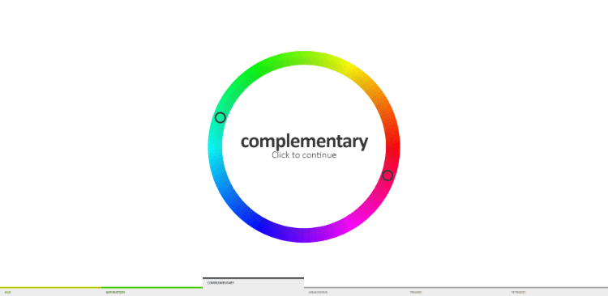

Color is important.

Color conveys emotions (urgency, calm, fun). It provides your readers with additional information (warnings vs disabled buttons). Color sets the tone of your website and guides your readers to where you want or need them to go.

If you're designing your brand or website, choosing a color palette is one of the first things you'll do.

But with so many colors to choose from, how do you decide which ones to use?

Here are some of my favorite color palette generators and color tools to help you design your brand and website.

## Color Inspiration

These tools are so helpful for generating color palettes and seeing them in use. I often use these tools first to get an idea of what colors would work best and then hone from there.

[Coolors](https://coolors.co/)

Coolors is a super fast and simple color palette generator. Press spacebar to generate a new palette, lock in colors that you like, adjust and refine colors, and then export your palette when you're ready.

[Color Safe](http://colorsafe.co/)

Color Safe is a tool to create accessible color palettes from the very beginning. Simply choose a background color to get started and this tool will generate colors that are guaranteed to contrast well with your chosen color.

[Dribbble Colors](https://dribbble.com/colors/67cae1)

Want to see beautiful artwork and illustrations that incorporate a particular color? Turn to Dribbble's color tool. Search for the color you want to see and Dribbble will provide you with a number of illustrations and projects that use that color. This is great for seeing if the color looks good in the wild or for finding more colors to add to your color palette.

[Pinterest](https://www.pinterest.com)

Pinterest is so useful for collecting and organizing colors, images, and textures that you love. Here, you can find plenty of curated color palettes. Here's my [Color Palettes](https://www.pinterest.ca/heather_tovey/color-palettes/) board to get you started.

[Site Palette Chrome Extension](https://chrome.google.com/webstore/detail/site-palette/pekhihjiehdafocefoimckjpbkegknoh)

A free browser extension for Chrome that generates color palettes based on any website. This tool auto generates color palettes using several different generators. You can choose which colors you like, create shareable links and fine-tune your color palette until it's just right.

[147 Colors](http://www.colors.commutercreative.com/grid/)

Want to use one of the 147 colors that have names? Use this tool to find a color you like and then find out what the name of the color is!

[Khroma](http://khroma.co/)

This is a tool that uses your top 50 color preferences to generate a color palette just for you. "By choosing a set of 50 colors, you'll train a neural network powered algorithm to generate colors you like and block ones you don’t, right in your browser."

[Gradient Hunt](https://gradienthunt.com/)

If you're a fan of modern gradients, check out Gradient Hunt. There are plenty of gradients here to start your project off right!

[AI Color Wheel](http://brandmark.io/color-wheel/)

Want to see how different colors look on your logo, illustrations, wireframes, or other graphics? Design them in grayscale and then use this tool to try on different colors.

## Accessibility and Color Contrast

While creating your color palette, keep in mind that not everyone sees color the same way. People have different vision limitations and these can affect the way your favorite colors look to them. Use these tools to help you create a color palette that doesn't leave anyone out.

[WebAim](https://webaim.org/resources/contrastchecker/)

A color contrast checker that will show you if your text passes [Web Content Accessibility Guidelines](https://www.w3.org/WAI/standards-guidelines/wcag/) (WCAG) at different standards. This tool is especially useful if you're new to WCAG because it tells you what it's testing for.

[Contrast Ratio](http://contrast-ratio.com) by Lea Verou

I personally love using this handy little tool put together by Lea Verou. Simply add your background color and your text color to see if your contrast ratio passes standards. If not, you can use the up and down keyboard arrows to change the colors and try to get closer to passing standards.

[Colorable](https://colorable.jxnblk.com/006655/9900ff)

Another useful way to test color contrast. Use sliders to change the Hue, Saturation, and Lightness of the different colors until your colors pass color contrast standards.

[NoCoffee](https://chrome.google.com/webstore/detail/nocoffee/jjeeggmbnhckmgdhmgdckeigabjfbddl/)

A Chrome browser extention that allows you to test websites and color palettes by showing you what those web pages look like for someone with slight or extreme vision problems. This tool tests how websites look with Low Acuity, Low Contrast Sensitivity, Colorblindness, Visual snow, glare, ghosting, and cataracts, Nystagmus, and Obstructed visual field. This will give you a good step toward making your website usable and visible for more people.

## Color Games

If you're having fun, it doesn't feel like learning right? These games may not be helpful for everyday color palette design, but they can help you level up your color skills!

[The X-Rite Color Challenge](https://www.xrite.com/hue-test)

Complete a quick hue sorting challenge to see if you have a color vision deficiency. This challenge doesn't replace a full exam, but it's fun to sort the colors and it may just turn up an issue you weren't aware of.

[Hex Invaders](http://www.hexinvaders.com/)

Want a fun way to practice your hexadecimal color knowledge? Play this game and shoot the hex invader whose color matches the hex code provided to you. Useful? Maybe not. Fun? YES!

[RGB Challenge](http://www.rgbchallenge.com/)

The RGB Challenge is similar to Hex Invaders but without the Invaders. Here, you choose the color that matches the RGB Color Code given to you. Could be a fun way to test your RGB knowledge!

[Color: A Color Matching Game](http://color.method.ac/)

Match the color in the center and get as close as you can! This can help you get more familiar with the color wheel and help you choose the correct color faster.

[Color Run](http://colorrun.pl/)

Okay, I can't pretend that I have any use for this game. You simply click on the lighter color of 2 colors as quickly as you can. The game ends when you click on a darker color. The more light colors you click on, the higher your score. Waste time with color!