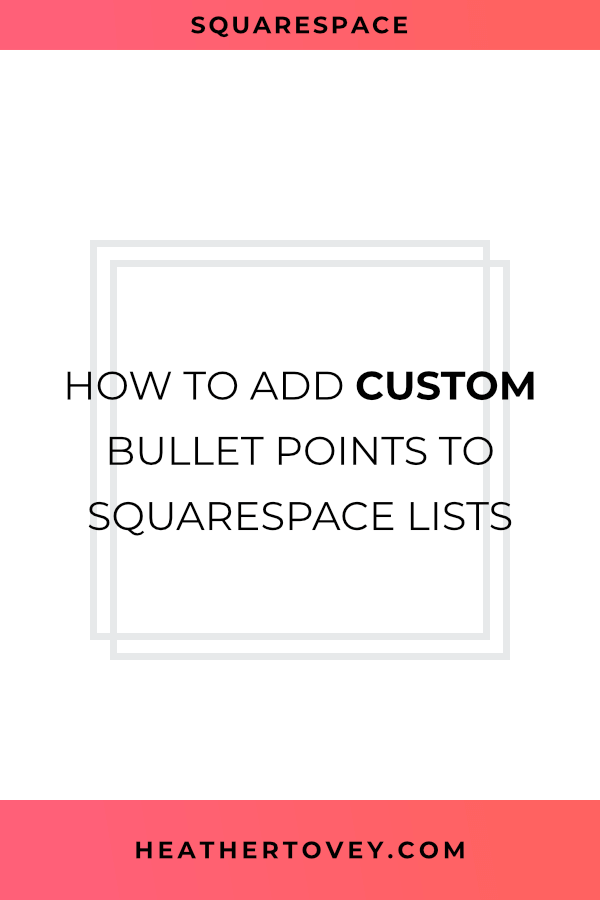

You’ve designed a beautiful website and have built it in Squarespace. [You’ve dotted every i and crossed every t](https://heathertovey.com/blog/pre-launch-checklist), but something feels like it’s missing.

When you create a website, it’s important to pay attention to the little details. They can give your website more personality and enhance your brand!

Want an easy way to add a small but beautiful detail to your website? **Use custom bullet points.**

Whenever you create a bulleted list in Squarespace, it looks something very similar to this:

- first item
    
- second item
    
- third item
    

It’s very plain and dull. It serves its purpose, but sometimes you want those bullet points to stand out.

So today, I’m going to walk you through adding custom bullet points to your Squarespace lists.



## Add Custom Bullet Points

### Step 1: Create an Icon

Design your icon in your tool of choice. I highly recommend creating a square image (even if the icon itself isn’t square) of at least 20 pixels wide and 20 pixels high just to make your life easier.

### Step 2: Upload the Icon

Go to **Design > Custom CSS > Manage Custom Files** and upload your icon.

### Step 3: Add Code

If you want to add custom bullet points to every bulleted list on your website, add the following code to **Design > Custom CSS**:

```less
.sqs-block-content ul {
  list-style-type: none;
}

.sqs-block-content li:before {
    content: '';
    display: block;
    height: 20px;
    position: relative;
    top: 23px;
    left: \-25px;
    width: 20px;
    background-image: url(YOUR URL HERE);
    background-size: contain;
    margin-right: 5px;
}
```

### Step 4: Add Your Icon URL

In the code above, there’s a little place where it says “YOUR URL HERE.” You’ll need to replace this with the actual URL for your new icon. If you uploaded it correctly in **Manage Custom Files**, all you need to do is click on the icon for Squarespace to automatically insert the URL into your Custom CSS for you.

Now you should be able to see your custom bullet point for every bulleted list!

## Bullet Points _Sometimes_

But maybe you just want custom bullet points in some places.

If so, you can use a tool like the [Squarespace ID Finder](https://heathertovey.com/squarespace-id-finder/) to find the exact block id for the list you want to add some style to.

Once you know the block ID, the custom code above turns into:

```less
#block-id-goes-here  ul {
  list-style-type: none;
}

#block-id-goes-here .sqs-block-content li:before {
    content: '';
    display: block;
    height: 20px;
    position: relative;
    top: 23px;
    left: \-25px;
    width: 20px;
    background-image: url(YOUR URL HERE);
    background-size: contain;
    margin-right: 5px;
}
```

Remember to replace **#block-id-goes-here** with your actual block id.

Or, if you really want to get your hands dirty, you can add custom code blocks with the following code anywhere on your pages to get custom bullet points.

```html
<ul class="custom-bullet-points">
  <li>Add your content here.</li>
  <li>Add your content here.</li>
  <li>Add your content here.</li>
</ul>
```

Then in **Design > Custom CSS**, the code changes to:

```less
.custom-bullet-points {
  list-style-type: none;
}

.custom-bullet-points li:before {
    content: '';
    display: block;
    height: 20px;
    position: relative;
    top: 23px;
    left: \-25px;
    width: 20px;
    background-image: url(YOUR URL HERE);
    background-size: contain;
    margin-right: 5px;
}
```

Now you can place special bullet point lists wherever you want them!

## One Squarespace Issue

Squarespace updated some of their code and it affects custom bullet point lists. If you find that this code doesn’t make the regular bullet points disappear, add the following code to Design > Custom CSS.

```less
ul[data-rte-list] li>*:first-child::before {
    content: "";
}
```

## Small and Magical Design Touches

Sometimes it’s the tiny details that really make a design sing. Try adding custom bullet points to your websites and see how it transforms the page!