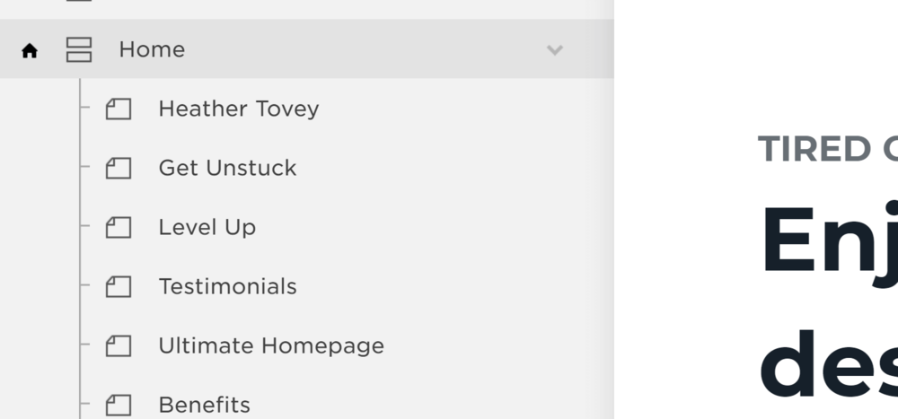
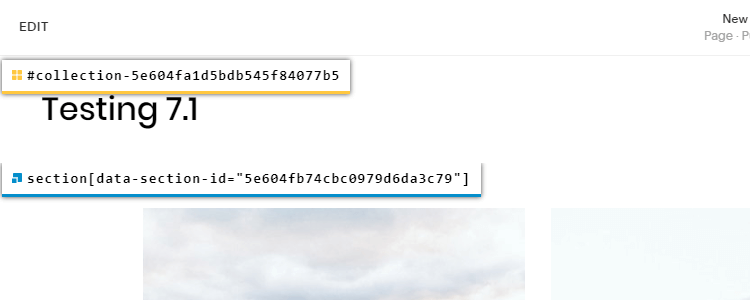
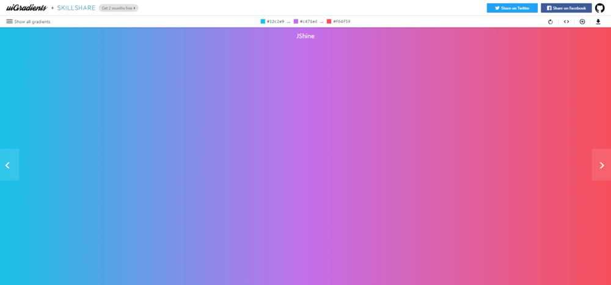
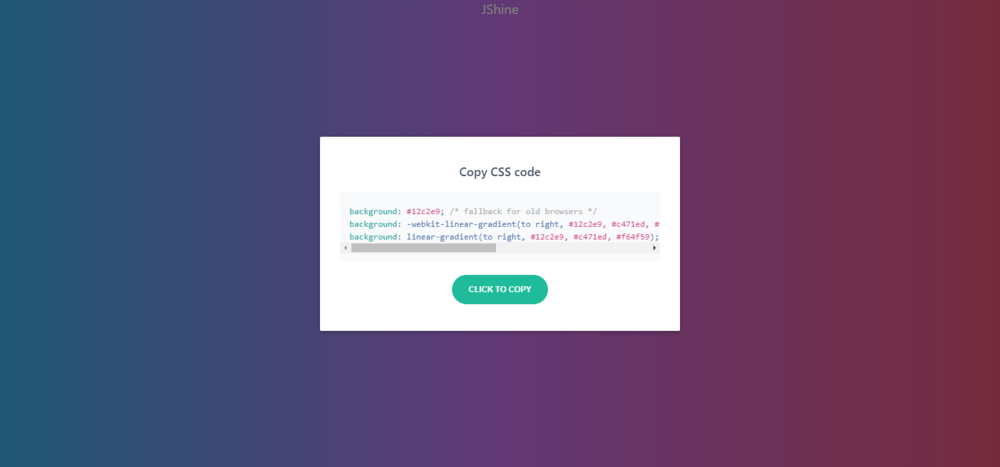

If you're a big fan of color, it's possible that you also love color gradients.


What's a gradient? A gradient in web design is an area filled with color where one color flows naturally into another color.

<div style="background: #000046;background: linear-gradient(90deg, #000046, #1CB5E0);background-size: 100% 100%;width:100%;height:200px;display:flex;text-align:center;align-items: center;line-height: 1.5;color:white;font-size:30px;justify-content:center;">For example, this block has a gradient background.</div>

## Gradients in Web Design

Here are a few examples of gradients that you may have seen around the web.

### Asana

[](https://asana.com/)

### Hubspot

[](https://www.hubspot.com/)

### Stripe

[](https://stripe.com/ca)

So how do you add gradients to your Squarespace website?

Now that you've seen a few ways that big companies use gradients on their websites, let's go over how you can add gradients to your website!

* * *

## Squarespace 7.0

This article was written before Squarespace 7.1 was released. The following instructions primarily cover 7.0. For [7.1 instructions](#version-7-1), scroll down just a little further.

**Note:** For the purposes of this tutorial, I'm going to specifically talk about adding gradients to Squarespace Index pages.

* * *

**Note 2:** I use the Brine template, and that's what this tutorial is based on. The methods in this tutorial should work in all Squarespace templates, but please let me know if you run into a template where it doesn't work.

* * *

### Step 1: Choose an Index Section

Before you can add any CSS code, you have to decide which Index Section is going to get a beautiful background gradient.

To do this, open up your settings, and navigate to the list of pages on your website. Under the Index Page, you'll find a list of Index Sections.

For example, I use a subtle gradient on the 2nd Index section found on my homepage. So in my settings, I can see that I named the 2nd Index section on my homepage "Get Unstuck."



### Step 2: Convert the Index Section Title into a Section ID

To add CSS to my "Get Unstuck" Index Section, I have to convert the page title into a section ID that I can use in my CSS code.

To convert your Index Section page title into a section ID:

- make your page title all lowercase
- replace any spaces in the title with hyphens
- add a **#** symbol at the beginning of the section ID

"Get Unstuck" becomes "#get-unstuck".

"Your Page Title Here" becomes "#your-page-title-here".

Alternatively, you can use the [Squarespace ID Finder](/squarespace-id-finder) to get this information without having to do the conversion yourself.

### Step 3: Add CSS Code

Once you have the Section ID, you can add CSS code. I recommend placing this code in Design > Custom CSS.

Here's some example code. You'll find plenty of copy/paste code to use in your own website in the [Resources](#resources-for-gradient-css-code) section below.

```less
#get-unstuck {
  background-color: #67cae1;
  background-image: linear-gradient(225deg,#67cae1,#7bd5d7);
}
```

Here's what that gradient looks like.
<div style="width: 100%;height:200px;background-color: #67cae1;background-image: linear-gradient(225deg,#67cae1,#7bd5d7);"></div>

There are 7 parts to this CSS code, so let's break it down a bit so you know what's happening.

1. The `#` symbol is used to tell the browser that you're targeting an id on your page.
2. After you write the `#` symbol, write the name of your `page-section-title` (remember to convert your page title to lowercase and replace spaces with hyphens). This will tell the browser which section to add the gradient background to.
3. Add a `background-color`. Some older browsers can't show background gradients and will show this solid background color instead.
4. Give your page section a `background-image` with the `linear-gradient` value.
5. Inside the `linear-gradient` value, choose the degree or angle of the gradient. I like a nice angled gradient, so I chose `225deg`. But you can choose another angle (between `0deg` and `360deg`) or remove this section entirely to get the default angle.
6. Inside the `linear-gradient` value, write down `Color1`.
7. Inside the `linear-gradient` value, write down `Color2`. The gradient will flow from `Color1` to `Color2`.

This is an example of a basic color gradient, but you can make them much more complicated if you choose.

## Squarespace 7.1

Squarespace 7.1 gets rid of index pages in favor of sections. Here, I'll walk you through how to find the section selector you'll need to use the code in this article.

### Step 1: Choose a Section

I highly recommend using my [Squarespace ID Finder tool](https://heathertovey.com/squarespace-id-finder/) to help you copy/paste the code you'll need. You can install the tool as a bookmarklet, Chrome extension, or Firefox addon.

Once you're on the page you want to add a gradient background to, turn on the Squarespace ID Finder to find the section selector. You can then click on the section selector to copy/paste it into your code.



### Step 2: Add CSS Code

Once you have the Section selector, you can add CSS code. I recommend placing this code in Design > Custom CSS.

Here's some example code. You'll find plenty of copy/paste code to use in your own website in the [Resources](#resources-for-gradient-css-code) section below.

```less
section[data-section-id="5e604fb74cbc0979d6da3c79"] .section-background {
  background-color: #67cae1;
  background-image: linear-gradient(225deg,#67cae1,#7bd5d7);
}
```

Here's what that gradient looks like.
<div style="width: 100%;height:200px;background-color: #67cae1;background-image: linear-gradient(225deg,#67cae1,#7bd5d7);"></div>

## Resources for Gradient CSS Code

Luckily for us, there are a ton of resources that will give you the specific code you need to create gradient backgrounds.

Once you know the ID of the section or block you're targeting, you can simply copy and paste the gradient code from these resources.

I recommend using [uiGradients](https://uigradients.com) to find gradients you like and copy/paste code.



uiGradients has plenty of different gradients to choose from and is a great way to get started with gradient backgrounds.

Once you choose a gradient, click on the CSS Code button in the top-right corner to get access to the code that you can copy/paste into Squarespace.



After you get comfortable with the code for adding CSS gradients, check out these extra resources for curated gradients:

- [Gradient Hunt](https://gradienthunt.com/)
- [WebGradients](https://webgradients.com/)
- [CSS Gradient](https://cssgradient.io/swatches/)

### Bonus! Animated Gradient Backgrounds

<style>
.animated-bg {
  background: linear-gradient(270deg, #4fcee3, #ce00ab);
  background-size: 400% 400%;
  width:100%;
  height:200px;
  font-size: 30px;
  color: white;
  display:flex;
  align-items: center;
  padding: 30px;
  line-height:1.5;
  text-align:center;

  -webkit-animation: AnimationName 30s ease infinite;
  -moz-animation: AnimationName 30s ease infinite;
  animation: AnimationName 30s ease infinite;
}

@-webkit-keyframes AnimationName {
  0%{background-position:0% 50%}
  50%{background-position:100% 50%}
  100%{background-position:0% 50%}
}
@-moz-keyframes AnimationName {
  0%{background-position:0% 50%}
  50%{background-position:100% 50%}
  100%{background-position:0% 50%}
}
@keyframes AnimationName {
  0%{background-position:0% 50%}
  50%{background-position:100% 50%}
  100%{background-position:0% 50%}
}
</style>

<div class="animated-bg">This block has an animated gradient background.</div>

To get an animated gradient background, I recommend using this [CSS Gradient Animator](https://www.gradient-animator.com/). Choose which colors you want in your gradient, and then copy/paste the code provided for you.