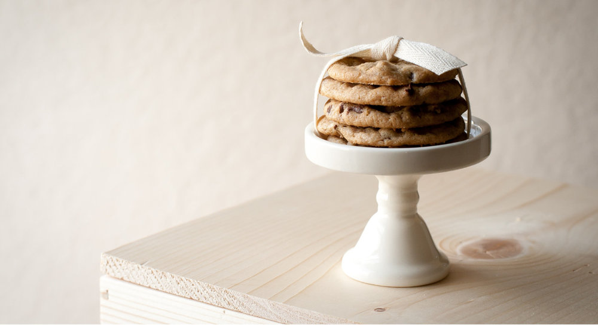
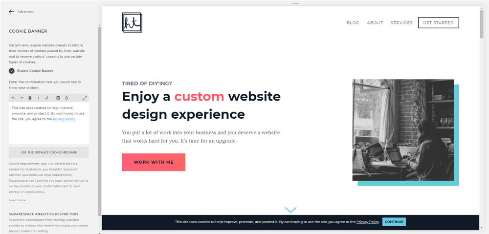
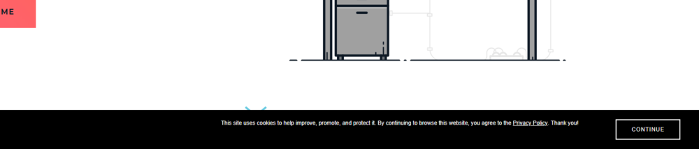
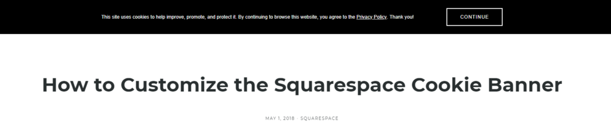
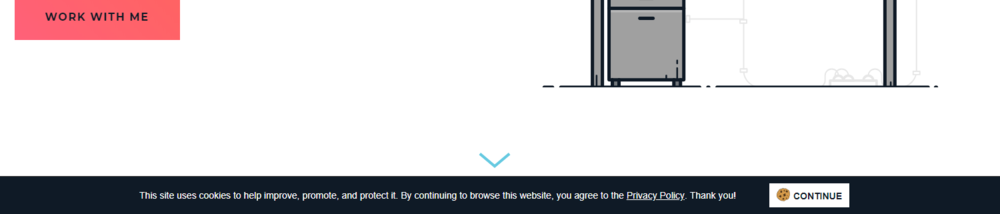

**UPDATE (September 21, 2018):** Squarespace made some changes to the Squarespace Cookie Banner Code (again). The following code has been updated to reflect these changes. If you have any issues with this code, please leave a comment and let me know so I can update it ASAP. Thank you.

* * *


Does your website use cookies?

If you run a newsletter, allow comments on your blog posts, or use analytics, you probably use cookies on your website.



> “Cookies are small bits of text that are downloaded to your browser as you surf the web. Their purpose is to carry bits of useful information about your interaction with the website that sets them.”

— [Joanna Geary](https://www.theguardian.com/technology/2012/apr/23/cookies-and-web-tracking-intro) from The Guardian

For example, cookies can be used to:

- provide information about which pages your readers visit the most
    
- show relevant ads to your visitors
    
- store information about what products your readers have put into a shopping cart
    

For more information about cookies and how they can be used on your website, check out [allaboutcookies.org](http://www.allaboutcookies.org/).

 

## Cookies and Privacy Issues

Cookies are useful for making your readers' experiences better, but there are privacy issues because they track your readers' browsing preferences and history.

Current guidelines recommend that you be completely up front and transparent about whether or not you use cookies and why.

 

_Disclaimer: I am not a lawyer and this is not legal advice. Please seek appropriate counsel for your website legal needs. This post seeks to only provide you with a way to customize a cookie banner if you choose to use one on your website._

 

## Squarespace EU Cookie Banner

Squarespace offers a built-in EU Cookie Banner where you can let your visitors know about the use of cookies on your website.

This setting is found in Settings > Website > Advanced > EU Cookie Banner.



There, you can choose to use the default Cookie Banner message or write your own. You also have the option of turning off Squarespace Analytics until your reader accepts the website cookies.

For more information on the Squarespace Cookie Banner and alternatives (plus another way to style it), check out Kerstin Martin's post [How to Customize Your Squarespace Cookie Banner](https://kerstinmartin.com/blog/cookie-banner).

 

* * *

  

**Update (August 2, 2018):** The default cookie banner got an update! You can keep the new default if you like, but personally, I'd make at least a couple of changes.

 

* * *

 

## Cookie Banner CSS Snippets

Before we get started, I just want to warn you that this is a code-heavy post.

If you're not as interested in the code and just want something that will work today (no judgment), feel free to [skip to the end](#code-snippets) and copy and paste those snippets into your Custom CSS (Design > Custom CSS). 

But if you have a bit of time to learn how to customize this code to fit your own brand, let's get started.

You might also like: [3 More Ways to Style the Squarespace Cookie Banner](/blog/style-the-squarespace-cookie-banner)

 

### Simple Cookie Banner



This code center aligns the text and button. Place it in **Design > Custom CSS**.

```less
.sqs-cookie-banner-v2 {
    justify-content: center !important;
}
```

 

## Customizing Your Cookie Banner

Now, if you're happy with the basic look, you can stop right there. But if you want to customize the banner so that it fits with your branding, read on.

To make the Cookie Banner fit in better with your brand, I recommend collecting colors from the color palette you're already using on your website. You'll need the following colors:

- a color for the banner background
    
- a color for the text on your banner
    
- a color for the button on your cookie banner
    
- a color for the button text
    

Check your Squarespace settings under Design > Style Editor to see what colors your website is currently using.

Once you have that information, here is a snippet you can use to customize your Squarespace Cookie Banner. All you need to do is fill in the blanks.

 

### Customized Cookie Banner Template

```less
// Change the background banner color
.sqs-cookie-banner-v2 {
    background-color: ___________ !important;
}

// Change the banner text color
.sqs-cookie-banner-v2-text p {
    color: ___________ !important;
}

// Change the link text color
.sqs-cookie-banner-v2 a {
    color: ___________ !important;
}

// Change the link text color when you hover over it
.sqs-cookie-banner-v2 a:hover {
    color: ___________ !important;
}

// Change the button backgrond color, border color, and text color.
.sqs-cookie-banner-v2-accept {
    border: ___________ !important;
    background-color: ___________ !important;
    color: ___________ !important;
}
```

 

## Examples

Personally, I understand concepts better with examples. So now, I'm going to show you the code I’m using for my banner.

Look at the code sample below to see how to add your own branding to your cookie banner.

### A Simple Cookie Banner



This design uses:

- black (`#0F1A26`) background color
- white (`#FFFFFF`) text color
- a white (`#FFFFFF`) button background color
- black (`#0F1A26`) button text color
- a cookie icon ([learn how to add an icon](https://heathertovey.com/blog/style-the-squarespace-cookie-banner))

```less
// Change the background banner color
.sqs-cookie-banner-v2 {
    background-color: #0F1A26 !important;
}

// Change the banner text color
.sqs-cookie-banner-v2-text p {
    color: white !important;
}

// Change the link text color
.sqs-cookie-banner-v2 a {
    color: white !important;
}

// Change the link text color when you hover over it
.sqs-cookie-banner-v2 a:hover {
    color: #ff596a !important;
}

// Change the button backgrond color, border color, and text color.
.sqs-cookie-banner-v2-accept {
    border: white !important;
    background-color: white !important;
    color: #0F1A26 !important;
}
```

This is a fun and simple cookie banner, but you're going to want a version that fits your branding.

 

## Squarespace Cover Pages

Unfortunately, Squarespace Cover Pages do not use the same CSS and JavaScript found across the rest of your site.

In order to make your Cookie Banner look better on Cover Pages, you will need to add your chosen code snippets to the "Page Header Code Injection" section found in the Advanced settings of **every** Cover Page.

You'll need to also add `<style>` tags to make it work.

```html
<style>
    Custom CSS Code Goes Here
</style>
```

Alternatively, if you want to hide the Cookie Banner on your Cover Page, paste the following code in each **Cover Page's Settings > Advanced > Page Header Code**.

```html
<style>
  .cookie-notice {
      display: none !important;
  }
</style>
```

 

## A Customized Cookie Banner is a Happy Cookie Banner

There are a lot of ways to display cookie banners to stand out or blend in. These are just a few examples of the styles you can apply to make your cookie banner fit in with your brand.