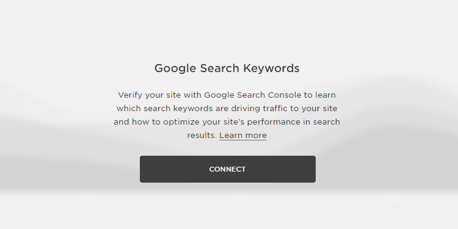
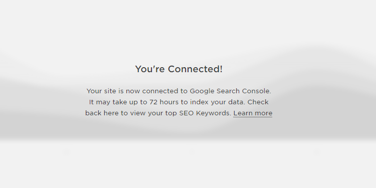
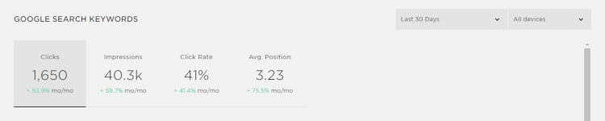
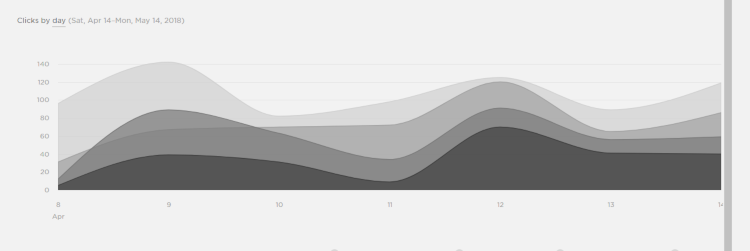
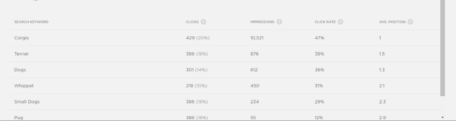

As an online entrepreneur, you've probably read a lot of different advice about how to rank higher in Google Search. SEO is important, and you know that, but sometimes it's hard to find solid, practical advice.

Luckily, Squarespace recently made your life a little easier by integrating Google Search Console with Squarespace Analytics.

In This Article

- [What is Google Search Console?](#what-is-google-search-console)
- [How to Add Google Search Keywords to Squarespace Analytics](#add-google-search-keywords-to-squarespace)
- [A Tour of the Google Search Keyword Dashboard](#tour-google-search-keyword)
- [What Can You Do with Google Search Keywords in Squarespace Analytics](#what-can-you-do-with-google-search-keywords)
- [What Else Can You Do with Google Search Console](#what-else-can-you-do-with-google-search-console)

## What is Google Search Console?

[Google Search Console](https://www.google.com/webmasters/tools/home?hl=en) is a free tool provided by, you guessed it, Google. It helps you gain valuable information about how your website performs in search rankings.

By integrating Google Search Console with your Squarespace website, you'll be able to:

- analyze how to rank better on search keywords
- figure out which content to edit and make better
- discover new ideas for blog posts that will bring in more traffic

And that's just the beginning. So let's get started.

 

## How to Add Google Search Keywords to Squarespace Analytics

Thankfully, Squarespace makes the process of integrating your website with Google Search Console easier than it has ever been before.

**Step 1:** Log into your Squarespace website.

**Step 2:** Go to Analytics and then click on the Google Search Keywords section.

**Step 3:** Press Connect and go through the process to verify your website.

You will need to be logged into your Google account to set up this integration.

Once you Verify your website, you should see a success message saying that you're connected! It can take up to 72 hours for Google Search Console to access and index your data, but once it's ready, you'll get access to incredibly useful information inside Squarespace Analytics.

Note: If you're not using a Squarespace website, you can [set up Google Search Console for your website using these instructions](https://support.google.com/webmasters/answer/6332964?hl=en). You'll potentially need to take some extra steps to verify your website, but the process is worth it. This post is predominantly written for Squarespace users, but the information will also apply to your Google Search Console account.

 

## A Tour of the Google Search Keyword Dashboard

Before I give you tips on what to do with the new information you have available to you inside Squarespace Analytics, let's take a quick tour of the Google Search Keywords section.

When you click on the Google Search Keywords section (found in Squarespace Analytics), you will find 3 main sections.

 

### Key Performance Indicators (KPI)

In this top section, Squarespace Analytics lets you look at four key performance indicators to learn more about how your website is performing in search results.

Clicks are how many times people clicked a link to your website from Google search results.

Impressions are how many times people saw a link to your website in Google search results.

Click Rate is the percentage of times people clicked on your website after seeing your link in Google search results. (Clicks / Impressions) x 100

Average Position is the position where your links are generally found on the Google search results page. A lower number means that the link to your website is found higher up on the page. For instance, an average position of 3 means that the links to your website are generally the 3rd search result on the page. Lower numbers are better than higher numbers.

 

### Performance Over Time Graph

Underneath the KPI section, you'll find a graph that shows how your site ranks in search results over time. This will let you see if there are increases or drops in search ranking position over time.

You can filter by KPI (Clicks, Impressions, Click Rate, and Avg. Position) and by date.

 

## Search Keyword Table

Underneath the graph, you'll find a table showing you how specific keywords perform for your website. For each keyword, you will have a separate listing of Clicks, Impressions, Click Rate, and Average Position. This will let you understand and compare how each separate search keyword works to send traffic to your website.

 

## What Can You Do with Google Search Keywords in Squarespace Analytics

Now that you know what new information you have available to you, you can use this information to see which search keywords are performing well for your website and which ones are not. Here are some questions you can ask yourself about this data.

 

### Are there any unexpected search keywords?

In your Google Search Keywords, you will find a lot of keywords that make sense to you because you've already written content about those keywords. But sometimes you'll find keywords that you weren't expecting and that you haven't really written focused content about.

 

### What new articles can you write to target those keywords specifically?

This is a great way to 1) see why people are visiting your website already and 2) get ideas about what content you can provide to make those people happier.

For example, let's say I have a website about adorable animals. I've written about kittens and puppies and ducklings. But in my Google Search Keywords, I'm finding that people are coming to my website to find information about penguins. If I don't have any content specifically about penguins, then that gives me a good direction to go in (if I feel that it still fits with my content).

Or perhaps I've written about the cuteness of kittens but people are visiting my website after trying to find out what kittens eat. Well then I can write an article specifically about what kittens eat.

If people are already coming to my website looking for this information, I'm happy to provide it as long as it still fits in with my overall content categories.

 

### Are there any high-performing keywords?

In your Google Search Keywords, you will likely find that some keywords perform better than others. Specifically, you want keywords that have higher Click Rates (double digits, at least) and have a lower Average Position (between 1 and 10 generally puts you on the first page of search results).

Take an inventory of your content and figure out which pages use those keywords. Think about what you're doing well on those pages already and what could use some improvement. Make your high-performing keywords perform even better.

 

### Are there any keywords that aren't performing as well as you'd like?

More specifically, if you have a low Click Rate on some of your keywords, you have a few strategies available to you.

If those keywords have an Average Position between 1-10, try editing the meta description and titles for those pages to be more enticing to your target audience. Use a length between 50 and 300 characters for your meta description so you don't accidentally cut off important information.

If those keywords have an Average Position higher than 10, consider editing the content associated with those keywords or creating new content to better target those keywords.

 

## What Else Can You Do with Google Search Console

Squarespace Analytics and Google Search Keywords are great tools to look at how your website is performing overall. Try using them for a while and practice making better content that specifically targets search keywords.

Once you feel comfortable using the search keyword information, you can graduate to the more advanced and in-depth information that you can find directly on the [Google Search Console tool](https://www.google.com/webmasters/tools/home?hl=en).

Here are just a few things you can do directly within the Google Search Console tool:

- See what your website links look like in search results so you can edit your meta description and titles to look better
- See missing or poorly written meta descriptions and titles
- See who is linking to your site (both good and bad)
- Disavow backlinks that are from shady websites
- See which of your pages Google thinks are most important and fine tune your pages by building internal links
- Find links that are pointing to content that isn't there anymore
- Hide URLs you don't want google to see

 

## Don't Panic

There is a wealth of information you can access about how your website is performing, but don't get overwhelmed. Take it one step at a time and work to improve your content and your website in manageable steps.

Use the information above to get started and enjoy having more information on how your website is performing.