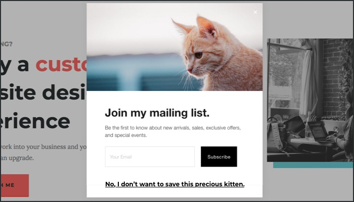
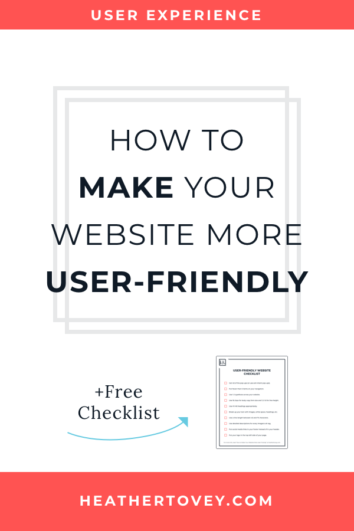
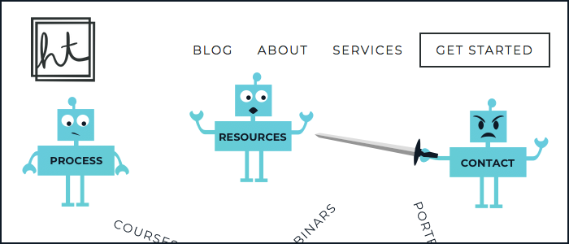
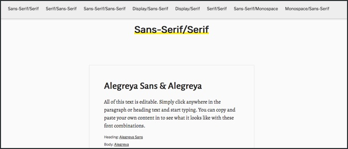
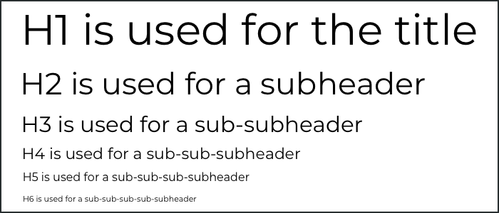
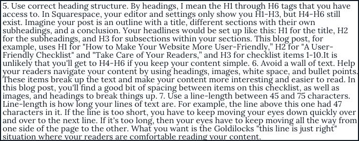
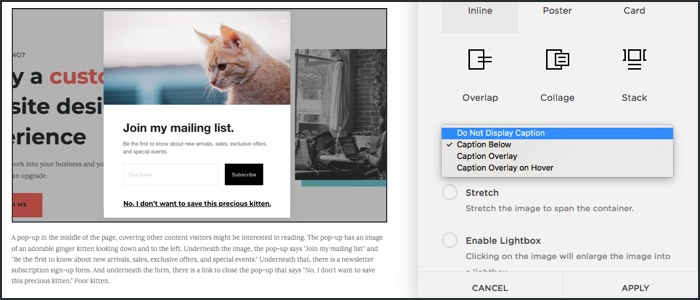
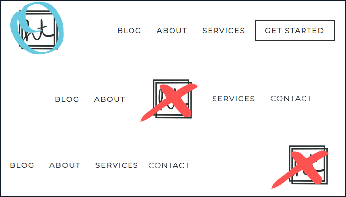

I hate pop-ups.

The pop-ups that try to guilt-trip you particularly enrage me.

You've probably seen these at some point. There's usually a little yes/no section at the bottom of the pop-up where the "No" choice is something like "No, I don't want to save 1000 puppies and kittens." Or something as equally ridiculous.

I happily and aggressively say no to those pop-ups as quickly as humanly possible. (How dare they try to use my emotions against me!)

Though annihilating pop-ups is at the top of my personal list, it isn't the only thing you can do to give your visitors a better user experience. So let's go over 10 ways you can make your website more user-friendly today.

## A User-Friendliness Checklist

### 1\. Get rid of the pop-ups.

(I told you it was at the top of my personal list.)

I'll admit it. Pop-ups are a contentious subject.

Some people swear by them and others despise them. It's true that pop-ups increase sign-ups but they also annoy your readers and lower the quality of your newsletter list.

But despite my lengthy rant, maybe you want to try out pop-ups on your website anyway.

If you do, **please** use exit-intent pop-ups. These pop-ups don't appear until your reader moves their mouse cursor out of the browser window. This usually indicates they're about to close the window or navigate elsewhere.

An exit-intent pop-up doesn't disrupt your reader's flow (as much) and doesn't pop up right when they start reading. It's the best type of pop-up there is, and I will grudgingly tolerate them.

### 2\. Keep your navigation simple.

I could write an entire article on the user-friendliness of navigation alone. But for now, let's just keep it simple.

If you have too many items on your menu, you're making your website pages compete for your reader's attention. Narrow down your menu items to the top 5 (or fewer!) pages that are important for your reader to visit.

### 3\. Use 1-2 typefaces across your website.

For most businesses, keeping your typography simple keeps readers focused on what you're saying. You don't want to distract them with a ton of scripty typefaces thrown about. Keep it simple.

A good rule of thumb is to pair one serif typeface with one sans-serif typeface. Or you can use one typeface that has a lot of different variations within it.

Use sites like [Font Pair](https://fontpair.co) to help you choose typefaces that look good together.

### 4\. Make your content easy to read.

Use a font-size between 16px and 25px for your body copy. Any lower than that and your words become harder to read.

Use a line-height between 1.2 and 1.6. Line-height is the amount of space above and below your text. The key is to give your text some breathing room. Take care of your readers' eyes!

This site uses a font-size of 20px and a line-height of 1.6 for body copy.

### 5\. Use correct heading structure.

By headings, I mean the H1 through H6 tags that you have access to in your editor. In Squarespace, your editor and settings only show you H1-H3, but H4-H6 still exist.

Imagine your post is an outline with a title, different sections with their own subheadings, and a conclusion.

Your headlines would be set up like this:

- H1 for the title
- H2 for the subheadings
- H3 for subsections within your sections

This blog post, for example, uses:

- H1 for "How to Make Your Website More User-Friendly"
- H2 for "A User-Friendly Checklist" and "Take Care of Your Readers"
- H3 for checklist items 1-10

It is unlikely that you'll get to H4-H6 if you keep your content simple.

### 6\. Avoid a wall of text.

Help your readers navigate your content by using headings, images, white space, and bullet points. These items break up the text and make your content more interesting and easier to read.

In this blog post, you'll find a good bit of spacing between items on this checklist, as well as images and headings to break things up.

### 7\. Use a line-length between 45 and 75 characters.

Line-length is how long your lines of text are.

For example, the line above this one had 47 characters in it.

If the line is too short, you have to keep moving your eyes down quickly.

If it's too long, then your eyes have to keep moving all the way from one side of the page to the other.

What you want is the Goldilocks "this line is just right" situation. A line-length between 45 and 75 characters is ideal for making your readers comfortable while reading.

There's a really useful [bookmarklet made by Chris Coyier](https://css-tricks.com/bookmarklet-colorize-text-45-75-characters-line-length-testing/) that I use all the time to help with this. I highly recommend dragging the bookmarklet to your bookmarks toolbar and using it to test line-length on your website. After you press the bookmarklet, you can click a paragraph and it will highlight the ideal line-length range in red.

### 8\. Use alt text for your images.

Alt text shows up in place of your image if the image doesn't load (usually due to a slow connection). Screenreaders also read out the alt text to people who can't see your images.

It is incredibly important that you describe your image very well so that someone who can't see it still knows what's going on.

In Squarespace, you can add an alt description to any image by typing into the caption box. If you choose "Do Not Display Caption", your caption becomes the alt description for the image.

If you're a Pinterest user, please be sure to read up on [why you should stop using alt tags for Pinterest pin descriptions](https://blog.tailwindapp.com/why-you-should-stop-using-alt-tags-for-pinterest-pin-descriptions/).

### 9\. Do not put social media links at the top of your pages.

You'll often find social media links in the header of a website. While convenient, it's basically like showing your visitors the door when they just arrived.

Put those links in your footer. Still convenient but not up front and in their faces.

### 10\. Put your logo on the top-left side of your website.

Your readers are used to finding the logo on the top-left side of the page. By putting your logo on the top-left side, you help them find your logo and remember it better.

> “Users are 89% more likely to remember logos shown in the traditional top-left position than logos placed on the right.”

— [Kathryn Whitenton](https://www.nngroup.com/articles/logo-placement-brand-recall/) from the Nielsen Norman Group

Your logo is often used as a link back to your homepage. So putting your logo on the top-left side of the page also helps your readers navigate your website.

> “Getting back to the homepage is about 6 times harder when the logo is placed in the center of a page compared to when it's in the top left corner.”

— [Kathryn Whitenton](https://www.nngroup.com/articles/centered-logos/) from the Nielsen Norman Group

Putting your logo in a non-standard place doesn't make your brand stand out. It just makes things harder for your readers.

## Take care of your readers

These guidelines come from a place of caring about your readers and wanting them to have an enjoyable experience.

The benefit is that they trust you, they stay on your site longer, and they're more likely to listen to you and hire you.

Take care of your readers and they'll take care of you.

## Get your free checklist!

Use this 10-item checklist to:

- transform your website
- provide a better experience for your readers
- get your readers to stay on your website longer

[Download Free Checklist](/wp-content/uploads/2019/04/user-friendly-checklist.pdf)
