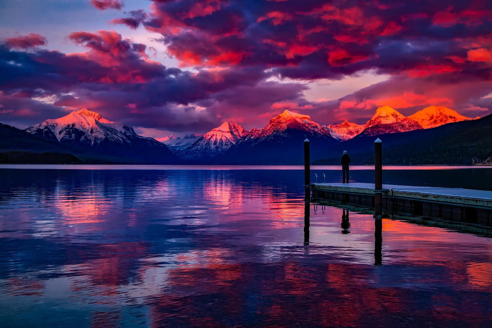
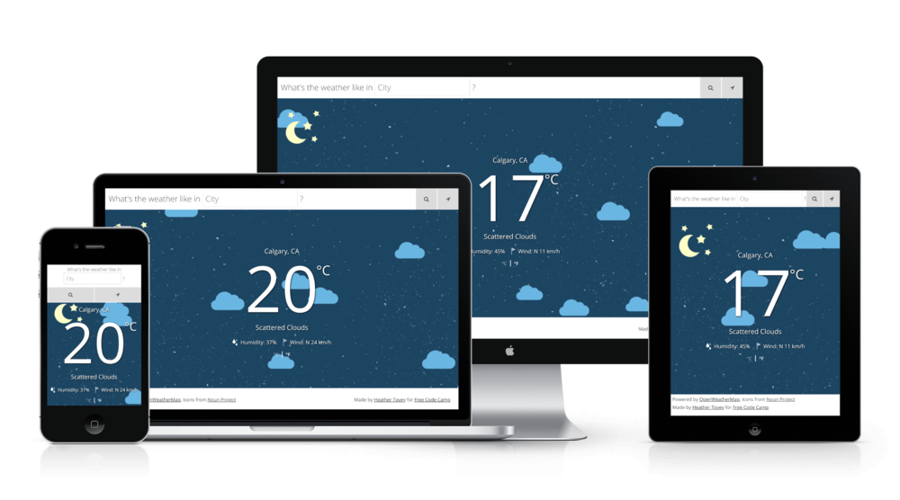
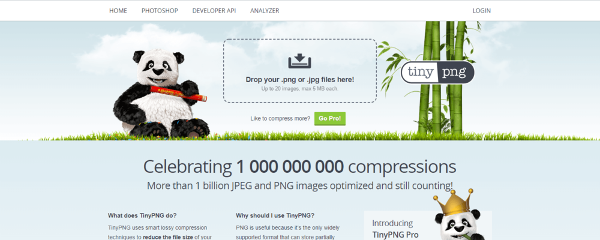

A few months ago, I helped a web designer troubleshoot an issue she was having with the website she was building.

The issue was that the website was **painfully** slow. It was so slow that it would crash the browser completely on mobile phones. 

After spending some time poking around in the code, I discovered she had over **200** massive images displayed on a slideshow gallery. The browser couldn't handle the huge page load and would crash trying to show the different images.

In the end, she had to have a chat with her client about choosing and showcasing only a handful of images. Once they settled on the prize images, the website was able to load quickly and visitors could actually navigate through the slideshow again. Phew! Problem solved.

While you may not have over 200 images slowing down your website, you're probably not doing enough to optimize your images.

Your website visitors won't stick around if your page takes too long to load. They're busy people and they don't have time to wait.

So today, I'm going to walk you through my entire image optimization process for a speedy website.

## Step 1: Use high-quality images.

Before you do anything else, you need high-quality images. If you can't get your hands on a high-quality image, you're better off without images entirely.

A high-quality image will add to your web design, but a low-quality image makes your website look unprofessional.

Ideally, you can take your own branded photos. But realistically, you may not know a lot about photography or you might not have the money or time right now to hire a photographer. If that's you, check out these resources to get you started:

- [Death to Stock](https://deathtothestockphoto.com/)
    
- [Unsplash](https://unsplash.com/)
    
- [Gratisography](https://gratisography.com/)
    
- [Pexels](https://www.pexels.com/)
    

## Step 2: Use the right file type.

What's the difference between a jpeg and a png?

That may sound like a setup to a super geeky joke, but it's actually an important piece of information you need when optimizing images for your website.

A jpeg is a type of image file that is best used for real-world photography, and images with a lot of colors, shades, and highlights. A jpeg will compress these types of images very well without it being obvious to the average person.

A png is a type of image file that is best used for icons, logos, and images that have transparent backgrounds. You can also use png for complex real-world photos, but you'll end up with a large file size that contributes to your slow site speed.

So be sure to choose the right format for your photos. If you're not sure, try saving your image as a jpg and as a png, and choose the one that looks great and has a smaller file size.

## Step 3: Resize your images.

One way to decrease image file size is to make your image smaller.

Squarespace recommends uploading images between **1500 and 2500 pixels wide**. Images larger than 2500 pixels wide are unnecessary and Squarespace cautions that large images can increase the time it takes your page to load.

I typically upload images that are 1500 pixels wide for my blog posts.

## Step 4: Name your image file correctly.

When saving your image, you might have something like Image (42).jpg or DSC2746. File names like this will hurt your SEO.

Google wants to know what the image is about without looking at it, so you should use descriptive and obvious names for your images.

Instead of DSC2746, rename to cute-puppy-with-bandana.jpg or something equally descriptive. Bonus points for choosing file names that fit the context. If you're talking about different types of breeds, cute-puppy-with-bandana.jpg doesn't help add to your point. Instead, you'd create a filename like pug-puppy.jpg.

## Step 5: Compress your images.

Once you've saved your image properly, it's time to compress your image and make it even smaller!

I'm a big fan of using [TinyPNG](https://tinypng.com/). This website allows you to easily drag and drop multiple images onto their compressor (up to 20 at a time for free). In no time, you'll have images that are potentially half the size (or less!) than the original without being able to tell the difference with your own eyes.

This is a must-do step before you ever upload images to your website.

## Upload Your Images

After following these 5 steps, you'll be ready to upload your image to Squarespace. Keep in mind that while you've significantly decreased the size of the images, too many images will still add up and slow down your website.

Only use the best images that help you to demonstrate your point. You don't need 200 images on one page. You just need the top 1-5 best images that show off your work.