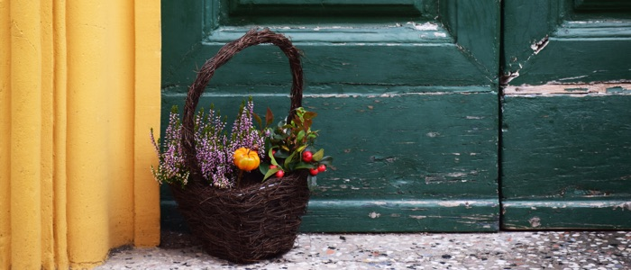
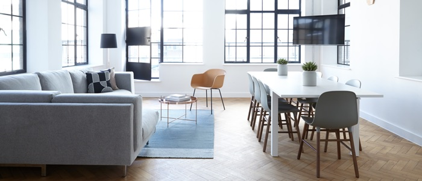
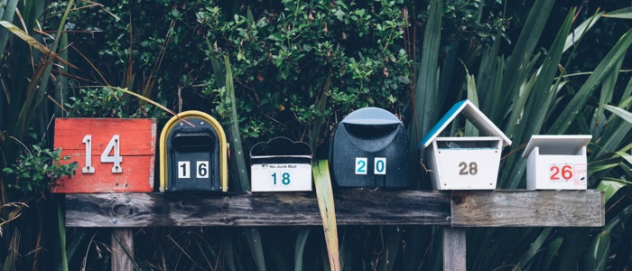
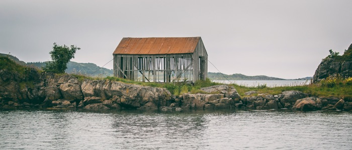
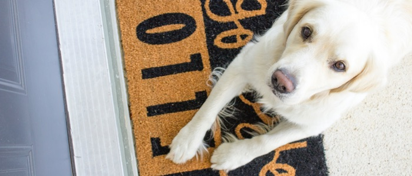
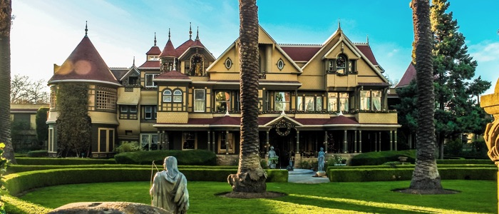
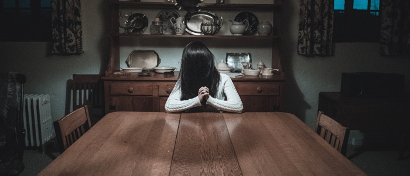
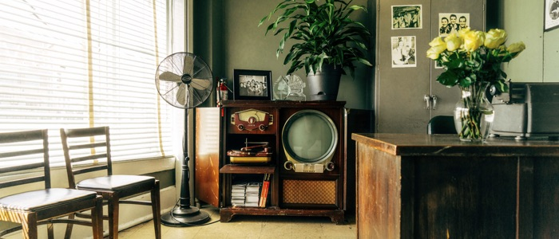

When I first moved into my house, the walls were a bright orangeish-yellow, and the trim was olive green and maroon.

My home looked like Tuscany had too much wine and threw up on it.

But the rest of the house was just what I needed. So I made the choice to keep the house and paint over the really terrible color scheme.

Fast-forward several years later, and the thought of buying a new house is high on my list. The current house was great when I was first starting out, but doesn't really fit what I need now. It requires far more maintenance than I have time for. Sure, I can make it work for a while longer, but it's time to get serious about moving.

You may be asking what my house has to do with redesigning your website.

Your website is your online home.

You're going to go through changes in your business and you need to make sure that your online home keeps up with you. But do you need a new paint job or an entirely new house?

Here are 8 questions to ask yourself before you redesign your website.

## 1\. Are you getting the results you want?

My house has no closets. That's right. No closets.

Weirdly, I'm mostly okay with not having any closet space. They're nice to have, but they don't help me with my goals:

- working in a beautiful and organized home office
    
- having enough space for my child to play and grow
    
- hosting small dinner parties for friends and family
    

Instead of closets, I should look for an open-space concept for entertaining, a backyard with room enough for my child to run around and play in the dirt, and space for a home office with access to a sunny window, shelving, and a large desk.

The closets are nice, but they're not going to help me meet my goals.

If you're like most online entrepreneurs, you want people to visit your website, stick around long enough to get to know you, and buy your services.

Does your website help you do that? Is it designed to help you with the things you need or is it merely designed to give you the nice-to-have features?

## 2\. Does your website make sense for your current business goals?

Imagine you moved into an amazing 1-bedroom apartment. It's beautiful and has a great view. It's exactly what you want!

But maybe later on you decide you want a big dog or you decide to get a roommate or get into a relationship. Maybe you want to have children.

Does the 1-bedroom apartment still work for you and what you need? Probably not.

Similar to a real house, it's possible to outgrow your online home.

Ask yourself:

- Are your business goals the same as they were when you first created your website?
    
- Is your ideal target audience still the same?
    
- Has your business grown in a way that isn't reflected in your website?
    

It's very likely that you've grown as an entrepreneur over time and that your website just doesn't fit your business needs anymore.

## 3\. Does your website work?

We've all seen houses that look like they haven't been loved in a long time.

The paint is peeling. The yard is overgrown. The windows are broken.

Much like a real-life house, websites need maintenance. They need to be cared for or else they can fall into such a state of disrepair that it might be better to demolish it and start over.

Ask yourself:

- Is it difficult for you to update or change your website content?
    
- Are there missing images and broken links?
    
- Do all of your pages look the way they're supposed to?
    
- Is your website secure?
    

You may only need to make a few quick fixes here and there. But if your website hasn't had some love in a while, it might need a redesign to get you started off on the right track again.

## 4\. Is your site mobile-friendly?

Have you ever seen a welcome mat with "hello" on one side and "goodbye" on the other?

Generally you're supposed to place the welcome mat where visitors see the "hello" side, but it's possible to turn it around if you want visitors to leave rather than...visit.

A mobile-friendly website puts a nice welcome mat out for everyone, no matter what device they use to view your content. With more and more people using mobile devices, having a mobile-friendly website is even more important than having a big, beautiful desktop version.

Do you want to roll out the welcome mat to everyone or do you want to lose out on potential sales?

## 5\. Do you need to restructure your content?

There's a famous house called the [Winchester Mystery House](http://www.winchestermysteryhouse.com/) located in San Jose, California. It's a mansion known for its grand size and complete lack of building plan.

> “...a window built into the floor, staircases leading to nowhere, a chimney that rises four floors, doors that open onto blank walls, and upside down posts!”

— Winchester Mystery House website

You do not want an online home that is completely disorganized, but it's easy to accidentally get there if you don't start off with a solid content strategy.

If your content is out of control or visitors are having trouble finding the content they're looking for, it may be time for a redesign.

## 6\. Is your website slow?

If I don't stay on top of it, my house suffers from clutter overload.

It's just so easy to fill up all the space and before I know it I can't find what I'm looking for.

Your online home can also suffer from clutter overload. The more images and content you have on each page, the more that page weighs and the longer it takes for your visitors to see your content in the first place.

It's possible you can fix the issue by optimizing your images and making a few other tweaks, but sometimes a complete overhaul is needed.

## 7\. Is your bounce rate high?

Imagine if someone visited your house, saw your living room, and high-tailed it out of there as fast as they could. You'd probably think something was wrong with your living room, right?

Your online home can suffer from the same issue.

If you're running analytics, check your bounce rate. Your bounce rate is generally considered to be the percentage of visitors who leave your website after only viewing one page.

If you have particular website pages that are scaring away visitors, you can optimize them. But if you have a lot of these pages across your website, it might be time for a redesign.

## 8\. Is your site design outdated?

Are you dealing with shag carpet, an avocado green color palette, and brass fixtures everywhere?

Design preferences change over time, and we're always looking for the next big trend.

You can make your website design last longer by choosing simple, classic looks over the hot new trends. But there will always be a point in time where your design starts to look dated, especially compared to competitors' websites.

How long has it been since your website got a design update?

It's possible to give your website a nice refresh by changing your color palette or getting rid of some elements (sliders, hamburger menus on desktop sites, too many fonts). But it's also possible that you need a bigger fix than a few tweaks can help with.

## Is it time for a new online home?

I've had a personal website since the early 2000s. This website looks nothing like the original, and I'll continue to redesign as my needs change.

After reading through the above checklist, you can decide for yourself if it's time for you to redesign your website. Take a long look at your current online home and make sure that your website is still right for your business needs.