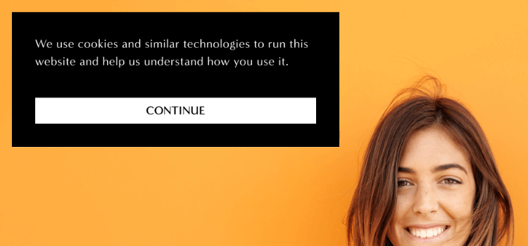
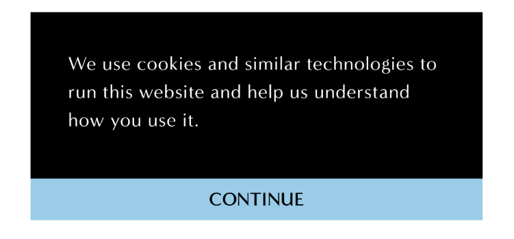
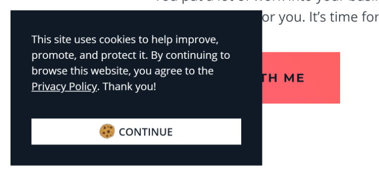

**UPDATE (September 21, 2018):** Squarespace made some changes to the Squarespace Cookie Banner Code. The following code has been updated to reflect the new changes. If you run into any issues, please leave a comment and I'll fix it ASAP. Thank you!

* * *

You may use a cookie banner on your website, but you don't have to use a cookie cutter version of it!

My last post about [customizing the Squarespace Cookie Banner](/blog/how-to-customize-the-squarespace-cookie-banner) was popular, so today I'm back with even more coding snippets for you to use on your Squarespace website.


## Rectangular Cookie Banner

If you don’t want a full-width cookie banner, you can choose to use a rectangular one instead.



To change your cookie banner, go to **Settings > Cookies & Visitor Data** and change the **Cookie Banner Type** to pop-up.

 You can change where this cookie banner box is positioned by changing the **Cookie Banner Position** settings.

 

## Full-Width Buttons

The default settings are pretty great, but perhaps you want a full-width button across the bottom of your banner.

With a little CSS, you can create a full-width button that stays within the box (like in the image above), or a full-width button that takes up the entire bottom part of the cookie banner box (image below).



```less
// Full-width button INSIDE cookie banner

.sqs-cookie-banner-v2-acceptWrapper {
    display: flex;
}

button.sqs-cookie-banner-v2-accept {
    width: 100%;
}
```
 
```less
// Full-width button OUTSIDE cookie banner

.sqs-cookie-banner-v2 {
    padding: 0;
}

.sqs-cookie-banner-v2-text {
    padding: 10px;
}

button.sqs-cookie-banner-v2-accept {
    width: 100%;
    margin: 0 !important;
}
```
 

## Add an icon to your button



To add an image to your Cookie Banner button, you'll first need to create an image. I made a 20px x 20px cookie image.

If you'd like, you can [download](https://heathertovey.com/wp-content/uploads/2018/05/cookie-small.png) the one I created for my website to use on your own website.

From there, you'll need to go to **Design > Custom CSS > Manage Custom Files** and upload your button icon.

Once you've uploaded your own button icon, add the following code to **Design > Custom CSS**.
```less
button.sqs-cookie-banner-v2-accept:before {
    content: url(IMAGE URL GOES HERE);
    position: relative;
    top: 2px;
    margin-right: 5px;
    display: inline-block;
    vertical-align: sub;
}
```
Replace the "IMAGE URL GOES HERE" with the URL to the image you just uploaded. You can click on the image under **Manage Custom Files** to quickly insert the URL into your Custom CSS Code.

 

## Avoid a Cookie Cutter Cookie Banner

So there you have it! 3 more ways to customize your Squarespace cookie banner. Experiment with icons and colors until your cookie banner fits your brand.